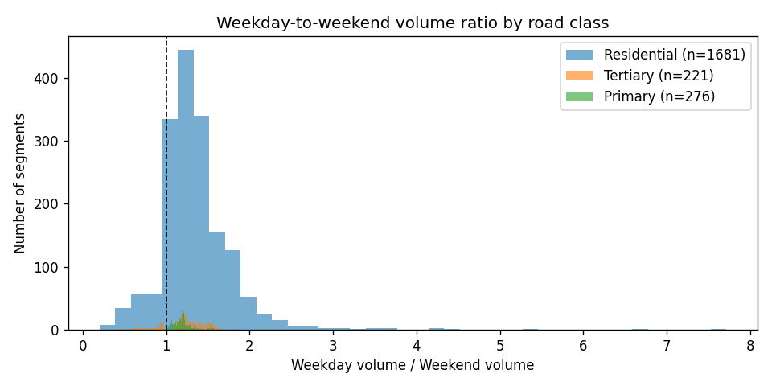

# Leonia traffic data — Phase 1 exploration

_Auto-generated by `scripts/01_explore_data.py`. Source: StreetLight Street Scanner exports under `streetlight/`._

## Data sources loaded

| Source label | Folder | Rows (study area) | Day Type | Day Part(s) |
| --- | --- | --- | --- | --- |
| all_days | streetlight | 3,176 | All Days | All Day |
| streetscanner_trend | streetscanner_trend | 0 |  |  |
| weekdays | weekdays | 3,037 | Weekday | Early AM (12am - 6am); Late PM (7pm - 12am); Mid-Day (10am - 3pm); Peak AM (6am  |
| weekend | weekend | 3,034 | Weekend | Early AM (12am - 6am); Late PM (7pm - 12am); Mid-Day (10am - 3pm); Peak AM (6am  |

> **Caveat.** The Weekday and Weekend exports list five day parts but contain only one row per segment — Street Scanner averaged across the selected parts. To get true per-day-part rows, re-pull each Day Part in its own export (see plan Part A.1).

## City/Town coverage

| City, County, State | Segments |
| --- | --- |
| Fort Lee, Bergen, New Jersey | 851 |
| Unincorporated, Bergen, New Jersey | 823 |
| Leonia, Bergen, New Jersey | 359 |
| Ridgefield Park, Bergen, New Jersey | 232 |
| Bogota, Bergen, New Jersey | 224 |
| Englewood, Bergen, New Jersey | 214 |
| Palisades Park, Bergen, New Jersey | 211 |
| Englewood Cliffs, Bergen, New Jersey | 81 |
| Edgewater, Bergen, New Jersey | 42 |

## Volume distribution by road class

**All days**

```
                 count     mean      std      min      50%      75%      90%      95%      99%      max
road_class                                                                                             
motorway         178.0  42990.6  19875.7    574.0  46422.5  58782.8  67059.3  69523.9  86319.6  92369.0
motorway_link    187.0  19036.7  10698.9   1678.0  17214.0  25178.5  33823.8  38573.7  48018.4  49047.0
primary          276.0  18605.9   7243.0   3222.0  18769.0  23994.5  28791.5  30655.0  31529.2  33473.0
primary_link      14.0   3806.1   4112.2    482.0   1824.5   5118.0  10644.6  12279.8  12597.6  12677.0
residential     1823.0    937.3   1407.4      2.0    385.0   1057.0   2653.8   4080.3   6252.3   9742.0
secondary        230.0   9594.7   4004.6   1473.0   8859.5  11247.2  15232.8  17656.7  21163.6  21801.0
secondary_link     1.0   2229.0      NaN   2229.0   2229.0   2229.0   2229.0   2229.0   2229.0   2229.0
tertiary         221.0   7676.7   5701.5     71.0   6992.0  10631.0  12610.0  17703.0  28554.4  30786.0
tertiary_link      1.0   1160.0      NaN   1160.0   1160.0   1160.0   1160.0   1160.0   1160.0   1160.0
trunk            156.0  42157.7  13133.1  14145.0  43155.0  54385.0  56494.0  57329.0  58593.8  60521.0
trunk_link        89.0   5783.9   6038.2    164.0   4372.0   7455.0  10602.0  14537.6  31081.2  32586.0
```

**Weekdays**

```
                 count    mean     std     min     50%      75%      90%      95%      99%      max
road_class                                                                                         
motorway         178.0  8679.6  3968.0   118.0  9279.0  11909.0  13337.5  13801.1  16895.6  17319.0
motorway_link    187.0  3896.2  2195.7   353.0  3489.0   5133.5   6953.2   7722.9  10065.5  10307.0
primary          276.0  3890.9  1500.8   700.0  3911.5   5003.2   5919.5   6271.5   6509.8   7072.0
primary_link      14.0   817.4   867.9   118.0   400.0   1147.8   2192.3   2571.6   2716.7   2753.0
residential     1684.0   216.8   306.1     1.0    90.0    264.0    615.0    887.8   1322.0   2059.0
secondary        230.0  1995.6   837.6   309.0  1880.0   2335.2   3225.7   3729.4   4422.5   4546.0
secondary_link     1.0   457.0     NaN   457.0   457.0    457.0    457.0    457.0    457.0    457.0
tertiary         221.0  1647.4  1234.8    16.0  1464.0   2322.0   2701.0   4471.0   6009.2   6431.0
tertiary_link      1.0   231.0     NaN   231.0   231.0    231.0    231.0    231.0    231.0    231.0
trunk            156.0  8683.5  2730.1  3012.0  8703.0  11281.5  11725.0  11976.8  12225.8  12684.0
trunk_link        89.0  1209.9  1243.5    34.0   915.0   1560.0   2175.0   2992.2   6358.9   6857.0
```

**Weekend**

```
                 count    mean     std     min     50%      75%      90%      95%      99%      max
road_class                                                                                         
motorway         178.0  8401.1  4096.8   107.0  8744.5  10823.8  13681.1  14510.5  18616.3  21366.0
motorway_link    187.0  3584.7  2045.1   291.0  3293.0   4975.0   6472.6   7483.4   8430.8   8689.0
primary          276.0  3295.2  1342.6   506.0  3166.5   4269.2   5202.5   5756.8   6038.5   6157.0
primary_link      14.0   620.3   716.3    42.0   277.0    713.2   1782.1   2085.0   2221.8   2256.0
residential     1681.0   167.8   245.0     1.0    71.0    191.0    460.0    711.0   1147.8   1810.0
secondary        230.0  1727.1   722.2   259.0  1586.0   2038.0   2638.7   3109.6   3764.0   3895.0
secondary_link     1.0   418.0     NaN   418.0   418.0    418.0    418.0    418.0    418.0    418.0
tertiary         221.0  1295.5   981.6    13.0  1231.0   1633.0   2149.0   3503.0   4955.8   5465.0
tertiary_link      1.0   233.0     NaN   233.0   233.0    233.0    233.0    233.0    233.0    233.0
trunk            156.0  7801.2  2390.8  2372.0  8464.5   9913.0  10200.0  10282.5  10491.2  10648.0
trunk_link        89.0  1023.9  1124.3    28.0   780.0   1289.0   2039.6   2700.2   5691.9   5889.0
```

Figures:
- `reports/figures/volume_by_road_class_all_days.png`
- `reports/figures/volume_by_road_class_weekdays.png`
- `reports/figures/volume_by_road_class_weekend.png`

## Weekday vs. Weekend asymmetry (cut-through signal)

Segments with a high **weekday / weekend volume ratio** are likely carrying commuter traffic rather than local trips. Residential and tertiary streets at the top of this list are prime cut-through suspects.

Of 2,044 residential/tertiary segments in the study area, 477 have a weekday/weekend ratio above 1.5 — strong commuter-bias signal.



### Top 30 cut-through suspects (residential + tertiary)

| Road | City | Class | Wkdy vol | Wknd vol | Wkdy/Wknd | Limit | On suspect list? |
| --- | --- | --- | --- | --- | --- | --- | --- |
| Willow Tree Road | Leonia, Bergen, New Jersey | residential | 345 | 81.00 | 4.26 | 25.00 | 0 |
| Willow Tree Road | Leonia, Bergen, New Jersey | residential | 505 | 161 | 3.14 | 25.00 | 0 |
| Willow Tree Road | Leonia, Bergen, New Jersey | residential | 667 | 228 | 2.93 | 25.00 | 0 |
| Vandelinda Avenue | Unincorporated, Bergen, New Jersey | residential | 212 | 79.00 | 2.68 | 25.00 | 0 |
| Vandelinda Avenue | Unincorporated, Bergen, New Jersey | residential | 213 | 82.00 | 2.60 | 25.00 | 0 |
| Vandelinda Avenue | Unincorporated, Bergen, New Jersey | residential | 282 | 112 | 2.52 | 25.00 | 0 |
| Vandelinda Avenue | Unincorporated, Bergen, New Jersey | residential | 256 | 105 | 2.44 | 25.00 | 0 |
| Vandelinda Avenue | Unincorporated, Bergen, New Jersey | residential | 338 | 150 | 2.25 | 25.00 | 0 |
| Grange Road | Unincorporated, Bergen, New Jersey | residential | 232 | 106 | 2.19 | 25.00 | 0 |
| Grange Road | Unincorporated, Bergen, New Jersey | residential | 267 | 130 | 2.05 | 25.00 | 0 |
| Bayview Avenue | Englewood Cliffs, Bergen, New Jersey | residential | 473 | 239 | 1.98 | 25.00 | 0 |
| Bayview Avenue | Englewood Cliffs, Bergen, New Jersey | residential | 483 | 249 | 1.94 | 25.00 | 0 |
| Bayview Avenue | Englewood Cliffs, Bergen, New Jersey | residential | 475 | 247 | 1.92 | 25.00 | 0 |
| Frank W Burr Boulevard | Unincorporated, Bergen, New Jersey | residential | 261 | 136 | 1.92 | 25.00 | 0 |
| Irving Avenue | Englewood Cliffs, Bergen, New Jersey | residential | 264 | 143 | 1.85 | 25.00 | 0 |
| Jones Road | Englewood, Bergen, New Jersey | tertiary | 1,464 | 794 | 1.84 | 25.00 | 0 |
| Irving Avenue | Englewood Cliffs, Bergen, New Jersey | residential | 247 | 134 | 1.84 | 25.00 | 0 |
| Frank W Burr Boulevard | Unincorporated, Bergen, New Jersey | residential | 283 | 155 | 1.83 | 25.00 | 0 |
| Hammett Avenue | Englewood Cliffs, Bergen, New Jersey | residential | 246 | 135 | 1.82 | 25.00 | 0 |
| East Sheffield Avenue | Englewood, Bergen, New Jersey | residential | 772 | 427 | 1.81 | 25.00 | 0 |
| Lindbergh Boulevard | Unincorporated, Bergen, New Jersey | residential | 311 | 173 | 1.80 | 25.00 | 0 |
| Lindbergh Boulevard | Unincorporated, Bergen, New Jersey | residential | 326 | 183 | 1.78 | 25.00 | 0 |
| Frank W Burr Boulevard | Unincorporated, Bergen, New Jersey | residential | 440 | 247 | 1.78 | 25.00 | 0 |
| Center Avenue | Fort Lee, Bergen, New Jersey | residential | 293 | 166 | 1.77 | 25.00 | 0 |
| East Lawn Drive | Unincorporated, Bergen, New Jersey | residential | 878 | 498 | 1.76 | 25.00 | 0 |
| Frank W Burr Boulevard | Unincorporated, Bergen, New Jersey | residential | 557 | 316 | 1.76 | 35.00 | 0 |
| Lindbergh Boulevard | Unincorporated, Bergen, New Jersey | residential | 451 | 256 | 1.76 | 25.00 | 0 |
| Lindbergh Boulevard | Unincorporated, Bergen, New Jersey | residential | 341 | 194 | 1.76 | 25.00 | 0 |
| Irving Avenue | Englewood Cliffs, Bergen, New Jersey | residential | 270 | 154 | 1.75 | 25.00 | 0 |
| Van Nostrand Avenue | Englewood Cliffs, Bergen, New Jersey | residential | 217 | 124 | 1.75 | 25.00 | 0 |

### Aggregated by street name

| Road | # top-30 segments | Mean Wkdy/Wknd | Mean weekday vol | Prior suspect? |
| --- | --- | --- | --- | --- |
| Willow Tree Road | 3 | 3.44 | 506 | 0 |
| Vandelinda Avenue | 5 | 2.50 | 260 | 0 |
| Grange Road | 2 | 2.12 | 250 | 0 |
| Bayview Avenue | 3 | 1.95 | 477 | 0 |
| Jones Road | 1 | 1.84 | 1,464 | 0 |
| Frank W Burr Boulevard | 4 | 1.82 | 385 | 0 |
| Hammett Avenue | 1 | 1.82 | 246 | 0 |
| Irving Avenue | 3 | 1.81 | 260 | 0 |
| East Sheffield Avenue | 1 | 1.81 | 772 | 0 |
| Lindbergh Boulevard | 4 | 1.77 | 357 | 0 |
| Center Avenue | 1 | 1.77 | 293 | 0 |
| East Lawn Drive | 1 | 1.76 | 878 | 0 |
| Van Nostrand Avenue | 1 | 1.75 | 217 | 0 |

## Speeding (avg speed above posted limit)

Average speed exceeding the posted limit on residential/tertiary streets is a secondary cut-through signal — commuters under time pressure tend to speed.

### Top 20 speeding segments — Weekday

| Road | City | Class | Limit | Avg speed | Over limit | Avg volume |
| --- | --- | --- | --- | --- | --- | --- |
| Roosevelt Avenue | Ridgefield Park, Bergen, New Jersey | residential | 25.00 | 40.00 | 15.00 | 3 |
| Brook Terrace | Leonia, Bergen, New Jersey | residential | 25.00 | 34.00 | 9.00 | 5 |
| North Avenue | Ridgefield Park, Bergen, New Jersey | residential | 25.00 | 33.00 | 8.00 | 1,259 |
| North Avenue | Ridgefield Park, Bergen, New Jersey | residential | 25.00 | 33.00 | 8.00 | 1,286 |
| North Avenue | Ridgefield Park, Bergen, New Jersey | residential | 25.00 | 31.00 | 6.00 | 1,249 |
| Myrtle Avenue | Englewood, Bergen, New Jersey | residential | 25.00 | 30.00 | 5.00 | 1,122 |
| Larch Avenue | Unincorporated, Bergen, New Jersey | residential | 25.00 | 30.00 | 5.00 | 536 |
| Palisade Avenue | Bogota, Bergen, New Jersey | tertiary | 25.00 | 30.00 | 5.00 | 2,370 |
| North Avenue | Ridgefield Park, Bergen, New Jersey | residential | 25.00 | 30.00 | 5.00 | 1,229 |
| Myrtle Avenue | Englewood, Bergen, New Jersey | residential | 25.00 | 30.00 | 5.00 | 1,139 |
| Palisade Avenue | Unincorporated, Bergen, New Jersey | tertiary | 25.00 | 30.00 | 5.00 | 2,378 |
| Larch Avenue | Bogota, Bergen, New Jersey | residential | 25.00 | 30.00 | 5.00 | 598 |
| Glenwood Avenue | Unincorporated, Bergen, New Jersey | residential | 25.00 | 29.00 | 4.00 | 1,710 |
| Lees Avenue | Unincorporated, Bergen, New Jersey | residential | 25.00 | 29.00 | 4.00 | 2 |
| Larch Avenue | Unincorporated, Bergen, New Jersey | residential | 25.00 | 29.00 | 4.00 | 535 |
| Glenwood Avenue | Unincorporated, Bergen, New Jersey | residential | 25.00 | 29.00 | 4.00 | 1,728 |
| Palisade Avenue | Unincorporated, Bergen, New Jersey | tertiary | 25.00 | 29.00 | 4.00 | 2,314 |
| East Sheffield Avenue | Englewood, Bergen, New Jersey | residential | 25.00 | 29.00 | 4.00 | 1,045 |
| Broad Avenue | Leonia, Bergen, New Jersey | tertiary | 25.00 | 29.00 | 4.00 | 1,452 |
| Larch Avenue | Unincorporated, Bergen, New Jersey | residential | 25.00 | 29.00 | 4.00 | 529 |

### Top 20 speeding segments — Weekend

| Road | City | Class | Limit | Avg speed | Over limit | Avg volume |
| --- | --- | --- | --- | --- | --- | --- |
| Roosevelt Avenue | Ridgefield Park, Bergen, New Jersey | residential | 25.00 | 43.00 | 18.00 | 3 |
| Brook Terrace | Leonia, Bergen, New Jersey | residential | 25.00 | 36.00 | 11.00 | 5 |
| North Avenue | Ridgefield Park, Bergen, New Jersey | residential | 25.00 | 34.00 | 9.00 | 1,172 |
| North Avenue | Ridgefield Park, Bergen, New Jersey | residential | 25.00 | 34.00 | 9.00 | 1,154 |
| Lees Avenue | Unincorporated, Bergen, New Jersey | residential | 25.00 | 32.00 | 7.00 | 3 |
| Hill Top Lane | Edgewater, Bergen, New Jersey | residential | 25.00 | 32.00 | 7.00 | 3 |
| North Avenue | Ridgefield Park, Bergen, New Jersey | residential | 25.00 | 32.00 | 7.00 | 1,144 |
| Washington Lane | Edgewater, Bergen, New Jersey | residential | 25.00 | 31.00 | 6.00 | 3 |
| Palisade Avenue | Unincorporated, Bergen, New Jersey | tertiary | 25.00 | 31.00 | 6.00 | 1,702 |
| Myrtle Avenue | Englewood, Bergen, New Jersey | residential | 25.00 | 30.00 | 5.00 | 917 |
| Walton Street | Englewood, Bergen, New Jersey | residential | 25.00 | 30.00 | 5.00 | 149 |
| North Avenue | Ridgefield Park, Bergen, New Jersey | residential | 25.00 | 30.00 | 5.00 | 1,138 |
| Larch Avenue | Bogota, Bergen, New Jersey | residential | 25.00 | 30.00 | 5.00 | 457 |
| Glenwood Avenue | Unincorporated, Bergen, New Jersey | residential | 25.00 | 30.00 | 5.00 | 1,179 |
| Myrtle Avenue | Englewood, Bergen, New Jersey | residential | 25.00 | 30.00 | 5.00 | 896 |
| Larch Avenue | Unincorporated, Bergen, New Jersey | residential | 25.00 | 30.00 | 5.00 | 414 |
| Palisade Avenue | Bogota, Bergen, New Jersey | tertiary | 25.00 | 30.00 | 5.00 | 1,694 |
| Broad Avenue | Englewood, Bergen, New Jersey | tertiary | 25.00 | 30.00 | 5.00 | 3,546 |
| Palisade Avenue | Unincorporated, Bergen, New Jersey | tertiary | 25.00 | 30.00 | 5.00 | 1,685 |
| Larch Avenue | Unincorporated, Bergen, New Jersey | residential | 25.00 | 30.00 | 5.00 | 404 |

## Interactive maps

Open these in a browser:

- `reports/maps/volume_all_days.html`
- `reports/maps/volume_weekdays.html`
- `reports/maps/volume_weekend.html`
- `reports/maps/weekday_weekend_ratio.html`
- `reports/maps/cutthrough_suspects.html` _(residential + tertiary only)_

## Headline findings

- The street with the highest mean Weekday/Weekend ratio in the top-30 list is **Willow Tree Road** (mean ratio 3.44 across 3 segments), with mean weekday volume 506.
- In **Leonia itself**, 27 of 241 residential segments have weekday/weekend ratio > 1.5.
- Top weekday speeders: Roosevelt Avenue (+15.0 mph), Brook Terrace (+9.0 mph), North Avenue (+8.0 mph).

These are pure data-side heuristics. Phase 6 will combine these with UXsim trajectory analysis to confirm true cut-through behavior.
