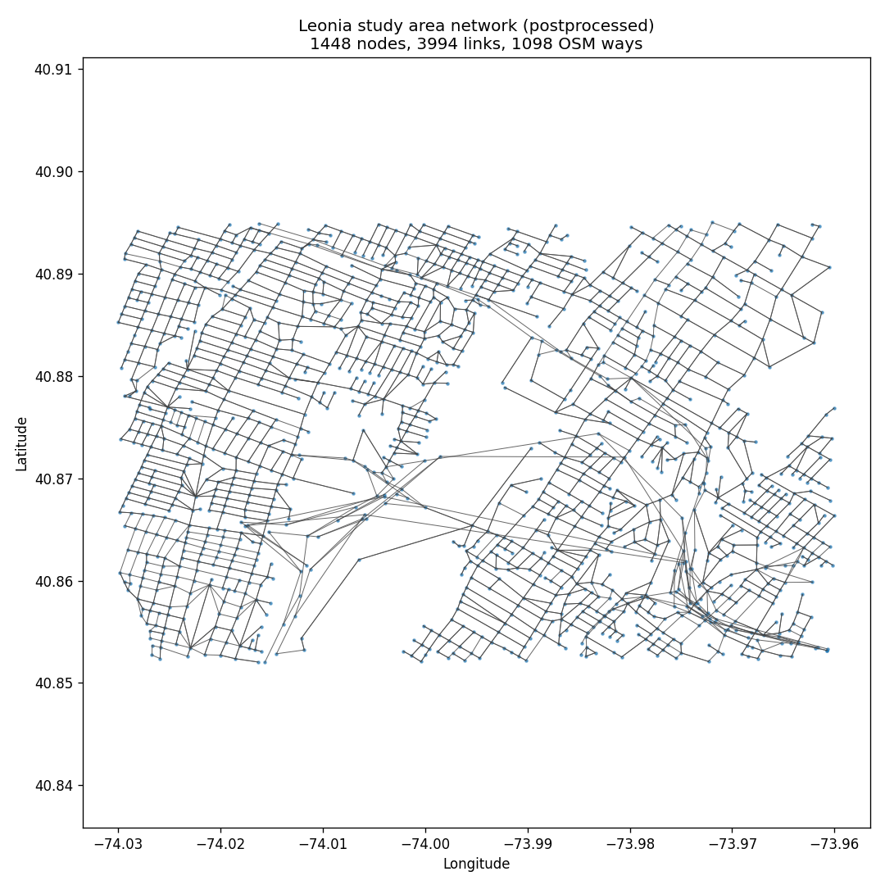

# Phase 2 — OSM → UXsim network

_Auto-generated by `scripts/02_build_network.py`. The network is cached at `data/network/leonia_osm_network.pkl`. Pass `--rebuild` to re-download from OSM._

## Build configuration

| Parameter | Value |
| --- | --- |
| bbox (lon/lat) | (-74.03, 40.852, -73.96, 40.895) |
| highway filter | `["highway"~"motorway|motorway_link|trunk|trunk_link|primary|primary_link|secondary|secondary_link|tertiary|tertiary_link|residential|unclassified"]` |
| node_merge_threshold_deg | 0.0005 |
| node_merge_iteration | 5 |
| enforce_bidirectional | False |
| overrides_path | /Users/mfeldbly/code/leonia/data/network/overrides.yaml |

## Network statistics

| Metric | Count |
| --- | --- |
| n_nodes | 1,448 |
| n_links | 3,994 |
| n_unique_osm_ways | 1,098 |
| n_isolated_nodes | 0 |
| n_pure_sinks | 8 |
| n_pure_sources | 10 |

## StreetLight ↔ UXsim link coverage

- Total UXsim links: **3,994**
- Matched to ≥1 StreetLight Weekday zone: **2,756** (69.0%)
- Unmatched: **1,238**

**Distribution of StreetLight zones per UXsim link (matched only)**

| Zones per link | # UXsim links |
| --- | --- |
| 1 | 759 |
| 2 | 435 |
| 3 | 417 |
| 4 | 304 |
| 5 | 198 |
| 6 | 93 |
| 7 | 85 |
| 8 | 147 |
| 9 | 34 |
| 10 | 64 |
| 11 | 40 |
| 12 | 40 |
| 13 | 36 |
| 14 | 50 |
| 15 | 14 |
| 18 | 12 |
| 19 | 28 |

### Sample of matched links (top 15 by observed volume)

| uxsim_link_name | osm_way_id | observed_volume | observed_avg_speed_mph | n_streetlight_zones | length_m | free_flow_speed_ms | lanes |
| --- | --- | --- | --- | --- | --- | --- | --- |
| George Washington Bridge Upper Level-120718209 | 120718209 | 17,172.0 | 28.0 | 1 | 133.7 | 8.3 | 4 |
| George Washington Bridge Lower Level-50074179 | 50074179 | 13,442.0 | 27.0 | 1 | 115.9 | 8.3 | 4 |
| George Washington Bridge Lower Level-1085503136 | 1085503136 | 13,437.0 | 42.0 | 1 | 1,246.6 | 8.3 | 1 |
| George Washington Bridge Upper Level-122095933 | 122095933 | 13,313.0 | 41.0 | 1 | 362.0 | 8.3 | 4 |
| George Washington Bridge Upper Level-124083371 | 124083371 | 12,688.0 | 39.0 | 1 | 218.8 | 8.3 | 3 |
| New Jersey Turnpike Local Roadway-42876898 | 42876898 | 12,508.0 | 61.0 | 1 | 1,908.5 | 8.3 | 3 |
| George Washington Bridge Upper Level-1303591877 | 1303591877 | 12,484.0 | 27.0 | 1 | 269.3 | 8.3 | 1 |
| New Jersey Turnpike Local Roadway-42508521 | 42508521 | 12,391.0 | 51.0 | 1 | 1,204.0 | 8.3 | 1 |
| New Jersey Turnpike-42361770 | 42361770 | 12,100.0 | 50.0 | 1 | 650.2 | 8.3 | 1 |
| New Jersey Turnpike-11563498 | 11563498 | 11,913.0 | 49.0 | 1 | 371.7 | 8.3 | 3 |
| New Jersey Turnpike Express Roadway-50074175 | 50074175 | 11,897.0 | 42.0 | 1 | 215.1 | 8.3 | 3 |
| New Jersey Turnpike Local Roadway-959996591 | 959996591 | 11,862.0 | 60.0 | 1 | 573.3 | 8.3 | 3 |
| New Jersey Turnpike Local Roadway-1232990081 | 1232990081 | 11,860.0 | 62.0 | 1 | 1,081.2 | 8.3 | 3 |
| New Jersey Turnpike Local Roadway-50074174 | 50074174 | 11,602.0 | 40.0 | 1 | 163.2 | 8.3 | 3 |
| New Jersey Turnpike Local Roadway-27274355 | 27274355 | 11,460.0 | 29.0 | 1 | 424.9 | 8.3 | 3 |

## Notes

- UXsim's OSM importer is officially **experimental**. Expect dead-ends, fragmented links, and occasional unrealistic free-flow speeds. Address with `data/network/overrides.yaml`.
- The match rate above is per UXsim link. Unmatched links are usually short connectors or motorway ramps for which StreetLight did not export a zone. The opposite is also true: StreetLight zones outside the Leonia bbox are ignored here.
