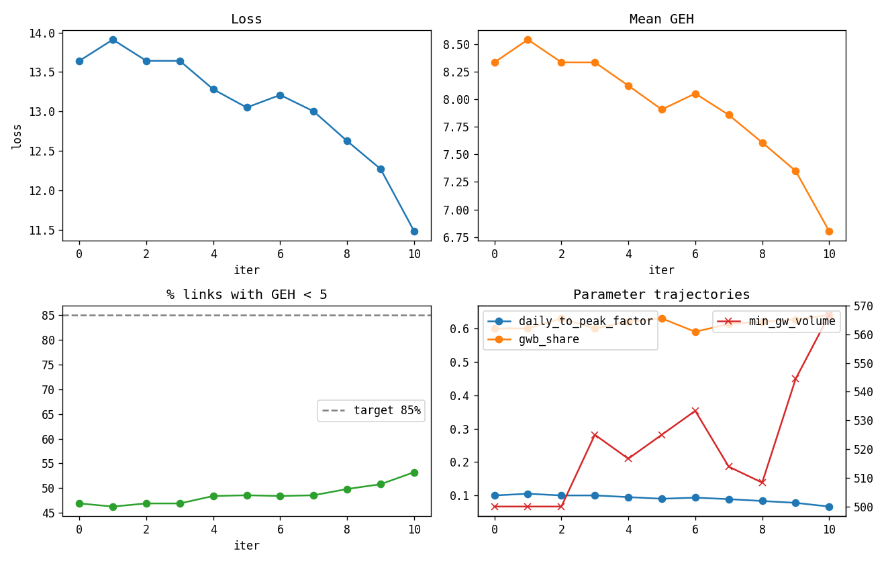

# Phase 4 — calibration

_Auto-generated by `scripts/03_calibrate.py`. Each iteration runs a full UXsim simulation and scores it against StreetLight observed Weekday flows via the GEH statistic._

## Best parameters

| Parameter | Value |
| --- | --- |
| daily_to_peak_factor | 0.0667 |
| gwb_share | 0.6400 |
| min_gateway_volume | 566.6667 |

## Best score (vs. observed Weekday flows)

| Metric | Value |
| --- | --- |
| geh_mean | 6.804 |
| geh_median | nan |
| geh_p85 | 12.772 |
| pct_lt_5 | 0.532 |
| pct_lt_10 | 0.751 |
| n_links_scored | 2059 |

The transport-modeling target is **GEH < 5 on ≥85% of links**. This run achieves 53.2% on 2059 matched links. Improving this requires:

- A more accurate gateway selection (Leonia polygon instead of bbox edge).
- True StreetLight OD data instead of synthetic destination splits.
- Per-link calibration of free-flow speed (UXsim's OSM defaults are coarse).
- Per-Day-Part Street Scanner data instead of weekday-averaged flow.

## Iteration history

| iter | loss | geh_mean | geh_p85 | pct_lt_5 | daily_to_peak_factor | gwb_share | min_gateway_volume |
| --- | --- | --- | --- | --- | --- | --- | --- |
| 0.0 | 13.642 | 8.333 | 15.643 | 0.469 | 0.1 | 0.6 | 500.0 |
| 1.0 | 13.911 | 8.539 | 16.029 | 0.463 | 0.105 | 0.6 | 500.0 |
| 2.0 | 13.642 | 8.334 | 15.643 | 0.469 | 0.1 | 0.63 | 500.0 |
| 3.0 | 13.642 | 8.333 | 15.643 | 0.469 | 0.1 | 0.6 | 525.0 |
| 4.0 | 13.28 | 8.123 | 15.247 | 0.484 | 0.095 | 0.62 | 516.667 |
| 5.0 | 13.049 | 7.906 | 14.84 | 0.486 | 0.09 | 0.63 | 525.0 |
| 6.0 | 13.209 | 8.051 | 15.112 | 0.484 | 0.093 | 0.59 | 533.333 |
| 7.0 | 13.0 | 7.857 | 14.748 | 0.486 | 0.089 | 0.613 | 513.889 |
| 8.0 | 12.624 | 7.607 | 14.28 | 0.498 | 0.083 | 0.62 | 508.333 |
| 9.0 | 12.269 | 7.349 | 13.796 | 0.508 | 0.078 | 0.627 | 544.444 |
| 10.0 | 11.481 | 6.804 | 12.772 | 0.532 | 0.067 | 0.64 | 566.667 |

