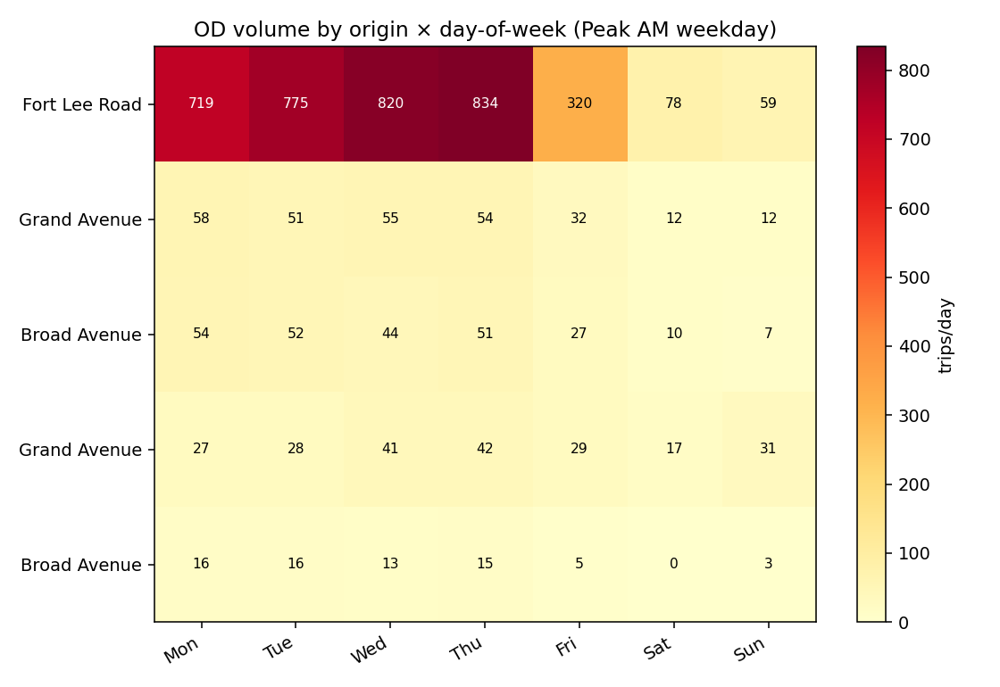
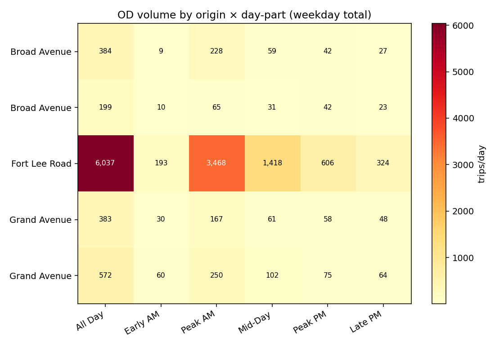
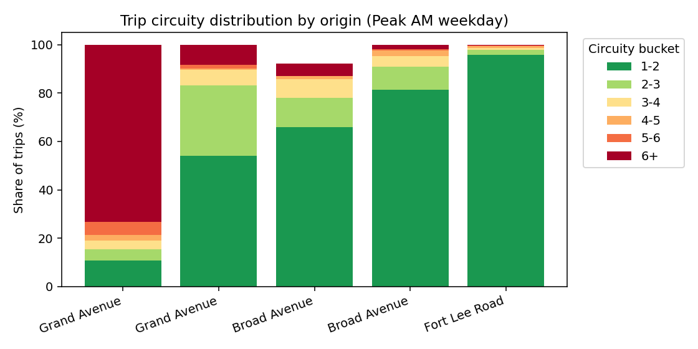
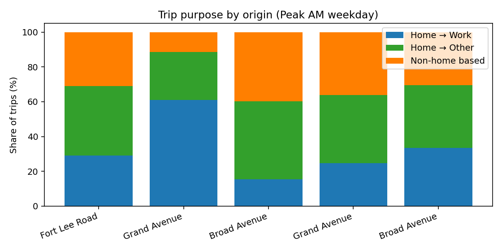
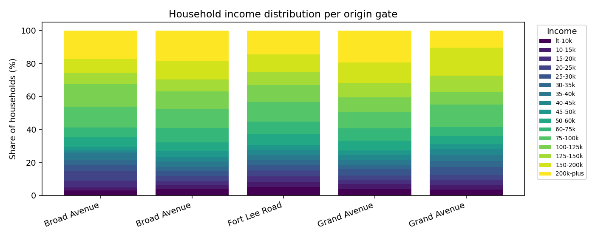
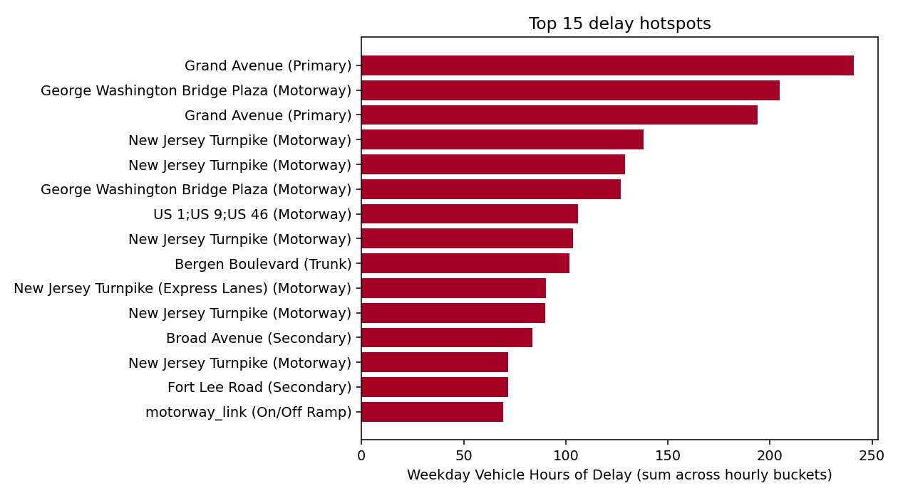

# Bridge OD + Congestion evidence report

Generated by `scripts/07_bridge_od_report.py`. Sources: `streetlight/bridge_destination/` (OD Analysis, Apr 2025 – Mar 2026) and `streetlight/congestion/` (Congestion Trends, Jan 2025 – Mar 2026). Recommendations: **43** rules triggered.

> **Scope of recommendations.** The Borough of Leonia has authority only over municipal streets located inside the borough limits. State and federal facilities crossing the borough (NJ Turnpike, George Washington Bridge & approaches, US 1/9/46, NJ 4, NJDOT ramps) are governed by NJDOT, the New Jersey Turnpike Authority, and the Port Authority of NY & NJ. The recommendation engine below filters all corridor-level rules to in-borough municipal streets only; OD-gate recommendations (Fort Lee Rd, Grand Ave, Broad Ave) target the Leonia-perimeter approach links the borough does control. State-road congestion is still surfaced in the data tables for situational awareness but is **not** subject to borough action.

## Headline

**Headline finding (Pass A.1):** The single largest source of Peak-AM weekday traffic into the GWB from the Leonia perimeter is **Fort Lee Road** (OSM way `590576`), with up to **834 trips** during a single Peak-AM window on Thursday (Th-Th). The four other Leonia gates combined typically contribute under 200 trips during the same window. Cut-through to the GWB is concentrated on **one corridor**.

## Gateway profiles

Volumes are summed across both GWB upper and lower-level destinations.

| Origin gate | OSM way | Weekday all-day avg | Weekend all-day avg | Peak AM (weekday) | Peak AM (weekend) | Peak PM (weekday) | Peak-AM weekday/weekend ratio |
| --- | --- | --- | --- | --- | --- | --- | --- |
| Fort Lee Road | 590,576 | 1,207 | 1,579 | 694 | 68 | 121 | 10.13 |
| Grand Avenue | 590,571 | 114 | 109 | 50 | 12 | 15 | 4.17 |
| Broad Avenue | 10,030,557 | 77 | 52 | 46 | 8 | 8 | 5.36 |
| Grand Avenue | 590,560 | 77 | 143 | 33 | 24 | 12 | 1.39 |
| Broad Avenue | 590,566 | 40 | 54 | 13 | 2 | 8 | 8.67 |

### Circuity-based cut-through evidence

| Origin gate | Direct (1-2) | Mild detour (2-3) | Heavy detour (3+) | Cut-through circuity index | Peak-AM trips analyzed |
| --- | --- | --- | --- | --- | --- |
| Grand Avenue | 10.7% | 4.6% | 84.7% | 0.893 | 250 |
| Grand Avenue | 54.0% | 29.2% | 16.8% | 0.460 | 167 |
| Broad Avenue | 65.8% | 12.1% | 14.4% | 0.265 | 65 |
| Broad Avenue | 81.4% | 9.3% | 9.2% | 0.186 | 228 |
| Fort Lee Road | 95.9% | 2.0% | 2.2% | 0.041 | 3,468 |

## Trip purpose decomposition

Weekday Peak-AM purpose mix by origin gate:

| Origin gate | Mon-Fri Peak-AM trips | Home → Work | Home → Other | Non-home based |
| --- | --- | --- | --- | --- |
| Fort Lee Road | 3,468 | 29.0% | 40.0% | 30.9% |
| Grand Avenue | 250 | 61.0% | 27.5% | 11.5% |
| Broad Avenue | 228 | 15.3% | 45.0% | 39.7% |
| Grand Avenue | 167 | 24.7% | 39.2% | 36.1% |
| Broad Avenue | 65 | 33.3% | 36.2% | 30.5% |

## Demographic profiles

Shares are volume-weighted across weekday all-day OD trips. StreetLight estimates these attributes from device home locations; they are not a direct survey of drivers.

### Broad Avenue (OSM way 10030557)

**Race / ethnicity / nativity / language / disability**:

- Race — white: 36.8%, black: 16.4%, american_indian: 0.7%, asian: 13.1%, pacific_islander: 0.0%, other_race: 20.5%, multiple_races: 12.6%
- Ethnicity — hispanic: 36.8%, non_hispanic: 63.2%
- Nativity — foreign_born: 33.8%, non_foreign_born: 66.2%
- Language — english_less_than_very_well: 21.1%
- Disability — with_disability: 9.7%, without_disability: 90.3%

**Household** (children, tenure, vehicles, structure):

- Children — with_kids: 39.0%, with_no_kids: 61.0%, with_kids_under_6: 17.5%, with_kids_6_17: 27.8%
- Tenure — owner_occupied: 62.6%, renter_occupied: 37.4%
- Vehicles — no_vehicle: 13.1%, one_vehicle: 34.3%, two_vehicles: 36.8%, three_plus_vehicles: 15.9%
- Unit_structure — single_unit: 52.7%, duplex: 19.9%, small_multi: 8.0%, medium_multi: 2.9%, large_multi_10_19: 2.1%, large_multi_20_49: 7.2%, fifty_plus_unit: 7.0%, mobile_other: 0.1%

**Income / education**:

- Income brackets: lt_10k: 3.0%, 10_15k: 1.8%, 15_20k: 4.1%, 20_25k: 5.9%, 25_30k: 3.6%, 30_35k: 3.0%, 35_40k: 4.7%, 40_45k: 1.3%, 45_50k: 2.3%, 50_60k: 5.8%, 60_75k: 5.8%, 75_100k: 12.6%, 100_125k: 13.5%, 125_150k: 7.1%, 150_200k: 8.3%, 200k_plus: 17.3%
- Education: less_than_9th: 6.1%, some_hs: 5.8%, hs_grad: 28.2%, some_college: 13.0%, associates: 4.1%, bachelors: 25.9%, grad_professional: 16.9%

**Employment industry / class**:

- Industry: agriculture_mining: 0.0%, construction: 3.3%, manufacturing: 4.9%, wholesale_trade: 4.0%, retail_trade: 5.6%, transportation_warehousing: 4.5%, information: 2.0%, finance_insurance_real_estate: 3.6%, professional_services: 7.0%, education_health_social: 16.2%, arts_entertainment: 5.3%, other_services: 2.5%, public_administration: 2.0%, military_industry: 0.0%, not_employed_industry: 39.0%
- Class: private_wage: 48.6%, government_workers: 7.0%, self_employed: 4.8%, unpaid_family: 0.6%, military_class: 0.0%, not_employed_class: 39.0%

**Equity aggregates**: low-income (<$50K): 29.6%, foreign-born: 33.8%, English limited: 21.1%, renter-occupied: 37.4%, no vehicle: 13.1%.

### Broad Avenue (OSM way 590566)

**Race / ethnicity / nativity / language / disability**:

- Race — white: 40.0%, black: 8.9%, american_indian: 0.7%, asian: 26.1%, pacific_islander: 0.0%, other_race: 14.0%, multiple_races: 10.3%
- Ethnicity — hispanic: 25.8%, non_hispanic: 74.2%
- Nativity — foreign_born: 36.7%, non_foreign_born: 63.3%
- Language — english_less_than_very_well: 22.5%
- Disability — with_disability: 8.9%, without_disability: 91.1%

**Household** (children, tenure, vehicles, structure):

- Children — with_kids: 46.3%, with_no_kids: 53.7%, with_kids_under_6: 19.0%, with_kids_6_17: 35.5%
- Tenure — owner_occupied: 59.9%, renter_occupied: 40.1%
- Vehicles — no_vehicle: 15.2%, one_vehicle: 34.9%, two_vehicles: 32.5%, three_plus_vehicles: 17.4%
- Unit_structure — single_unit: 55.4%, duplex: 12.8%, small_multi: 7.4%, medium_multi: 4.5%, large_multi_10_19: 3.1%, large_multi_20_49: 6.3%, fifty_plus_unit: 10.3%, mobile_other: 0.3%

**Income / education**:

- Income brackets: lt_10k: 3.8%, 10_15k: 2.7%, 15_20k: 2.3%, 20_25k: 2.9%, 25_30k: 3.1%, 30_35k: 2.5%, 35_40k: 3.2%, 40_45k: 3.0%, 45_50k: 3.4%, 50_60k: 5.3%, 60_75k: 8.6%, 75_100k: 11.4%, 100_125k: 11.0%, 125_150k: 7.1%, 150_200k: 11.3%, 200k_plus: 18.4%
- Education: less_than_9th: 6.6%, some_hs: 4.9%, hs_grad: 21.2%, some_college: 14.6%, associates: 7.5%, bachelors: 27.9%, grad_professional: 17.2%

**Employment industry / class**:

- Industry: agriculture_mining: 0.1%, construction: 3.3%, manufacturing: 4.3%, wholesale_trade: 2.2%, retail_trade: 6.3%, transportation_warehousing: 3.7%, information: 1.3%, finance_insurance_real_estate: 5.4%, professional_services: 7.9%, education_health_social: 15.7%, arts_entertainment: 4.8%, other_services: 3.9%, public_administration: 2.1%, military_industry: 0.2%, not_employed_industry: 38.7%
- Class: private_wage: 46.0%, government_workers: 8.1%, self_employed: 6.9%, unpaid_family: 0.0%, military_class: 0.2%, not_employed_class: 38.8%

**Equity aggregates**: low-income (<$50K): 26.9%, foreign-born: 36.7%, English limited: 22.5%, renter-occupied: 40.1%, no vehicle: 15.2%.

### Fort Lee Road (OSM way 590576)

**Race / ethnicity / nativity / language / disability**:

- Race — white: 43.9%, black: 17.5%, american_indian: 0.7%, asian: 11.7%, pacific_islander: 0.0%, other_race: 14.9%, multiple_races: 11.2%
- Ethnicity — hispanic: 27.8%, non_hispanic: 72.2%
- Nativity — foreign_born: 29.7%, non_foreign_born: 70.3%
- Language — english_less_than_very_well: 16.7%
- Disability — with_disability: 10.4%, without_disability: 89.6%

**Household** (children, tenure, vehicles, structure):

- Children — with_kids: 46.2%, with_no_kids: 53.8%, with_kids_under_6: 19.8%, with_kids_6_17: 35.5%
- Tenure — owner_occupied: 55.3%, renter_occupied: 44.7%
- Vehicles — no_vehicle: 17.8%, one_vehicle: 34.5%, two_vehicles: 31.3%, three_plus_vehicles: 16.4%
- Unit_structure — single_unit: 52.9%, duplex: 12.9%, small_multi: 7.8%, medium_multi: 4.6%, large_multi_10_19: 4.2%, large_multi_20_49: 6.5%, fifty_plus_unit: 10.7%, mobile_other: 0.5%

**Income / education**:

- Income brackets: lt_10k: 5.1%, 10_15k: 3.2%, 15_20k: 3.2%, 20_25k: 3.6%, 25_30k: 3.0%, 30_35k: 3.2%, 35_40k: 3.3%, 40_45k: 3.0%, 45_50k: 2.9%, 50_60k: 6.5%, 60_75k: 7.7%, 75_100k: 11.9%, 100_125k: 10.4%, 125_150k: 7.9%, 150_200k: 10.5%, 200k_plus: 14.6%
- Education: less_than_9th: 5.8%, some_hs: 5.3%, hs_grad: 27.1%, some_college: 16.7%, associates: 6.9%, bachelors: 22.4%, grad_professional: 15.9%

**Employment industry / class**:

- Industry: agriculture_mining: 0.1%, construction: 3.4%, manufacturing: 4.5%, wholesale_trade: 2.1%, retail_trade: 6.8%, transportation_warehousing: 4.6%, information: 1.8%, finance_insurance_real_estate: 5.1%, professional_services: 7.9%, education_health_social: 15.8%, arts_entertainment: 4.4%, other_services: 3.0%, public_administration: 2.4%, military_industry: 0.1%, not_employed_industry: 37.8%
- Class: private_wage: 48.4%, government_workers: 8.3%, self_employed: 5.3%, unpaid_family: 0.1%, military_class: 0.1%, not_employed_class: 37.8%

**Equity aggregates**: low-income (<$50K): 30.5%, foreign-born: 29.7%, English limited: 16.7%, renter-occupied: 44.7%, no vehicle: 17.8%.

### Grand Avenue (OSM way 590560)

**Race / ethnicity / nativity / language / disability**:

- Race — white: 41.7%, black: 11.1%, american_indian: 0.6%, asian: 23.1%, pacific_islander: 0.0%, other_race: 13.4%, multiple_races: 10.0%
- Ethnicity — hispanic: 24.5%, non_hispanic: 75.5%
- Nativity — foreign_born: 34.9%, non_foreign_born: 65.1%
- Language — english_less_than_very_well: 19.7%
- Disability — with_disability: 8.5%, without_disability: 91.5%

**Household** (children, tenure, vehicles, structure):

- Children — with_kids: 45.4%, with_no_kids: 54.6%, with_kids_under_6: 19.6%, with_kids_6_17: 34.6%
- Tenure — owner_occupied: 57.7%, renter_occupied: 42.3%
- Vehicles — no_vehicle: 18.2%, one_vehicle: 32.9%, two_vehicles: 36.5%, three_plus_vehicles: 12.3%
- Unit_structure — single_unit: 49.8%, duplex: 11.8%, small_multi: 7.6%, medium_multi: 4.1%, large_multi_10_19: 3.5%, large_multi_20_49: 7.1%, fifty_plus_unit: 15.5%, mobile_other: 0.7%

**Income / education**:

- Income brackets: lt_10k: 3.9%, 10_15k: 3.0%, 15_20k: 2.4%, 20_25k: 2.9%, 25_30k: 3.7%, 30_35k: 2.8%, 35_40k: 2.9%, 40_45k: 2.8%, 45_50k: 2.9%, 50_60k: 6.0%, 60_75k: 7.4%, 75_100k: 9.9%, 100_125k: 9.0%, 125_150k: 8.6%, 150_200k: 12.5%, 200k_plus: 19.4%
- Education: less_than_9th: 6.2%, some_hs: 4.7%, hs_grad: 21.7%, some_college: 13.8%, associates: 5.7%, bachelors: 27.8%, grad_professional: 20.0%

**Employment industry / class**:

- Industry: agriculture_mining: 0.0%, construction: 2.7%, manufacturing: 3.9%, wholesale_trade: 2.1%, retail_trade: 6.2%, transportation_warehousing: 3.5%, information: 1.9%, finance_insurance_real_estate: 7.0%, professional_services: 8.8%, education_health_social: 15.5%, arts_entertainment: 4.3%, other_services: 4.4%, public_administration: 1.9%, military_industry: 0.0%, not_employed_industry: 37.7%
- Class: private_wage: 48.0%, government_workers: 6.9%, self_employed: 7.3%, unpaid_family: 0.1%, military_class: 0.0%, not_employed_class: 37.7%

**Equity aggregates**: low-income (<$50K): 27.2%, foreign-born: 34.9%, English limited: 19.7%, renter-occupied: 42.3%, no vehicle: 18.2%.

### Grand Avenue (OSM way 590571)

**Race / ethnicity / nativity / language / disability**:

- Race — white: 35.4%, black: 7.3%, american_indian: 0.9%, asian: 31.7%, pacific_islander: 0.0%, other_race: 14.3%, multiple_races: 10.5%
- Ethnicity — hispanic: 27.2%, non_hispanic: 72.8%
- Nativity — foreign_born: 46.0%, non_foreign_born: 54.0%
- Language — english_less_than_very_well: 31.6%
- Disability — with_disability: 7.4%, without_disability: 92.6%

**Household** (children, tenure, vehicles, structure):

- Children — with_kids: 40.4%, with_no_kids: 59.6%, with_kids_under_6: 14.6%, with_kids_6_17: 30.9%
- Tenure — owner_occupied: 55.6%, renter_occupied: 44.4%
- Vehicles — no_vehicle: 16.1%, one_vehicle: 33.0%, two_vehicles: 28.8%, three_plus_vehicles: 22.0%
- Unit_structure — single_unit: 52.5%, duplex: 15.6%, small_multi: 5.8%, medium_multi: 2.8%, large_multi_10_19: 5.7%, large_multi_20_49: 7.0%, fifty_plus_unit: 10.0%, mobile_other: 0.5%

**Income / education**:

- Income brackets: lt_10k: 3.6%, 10_15k: 2.8%, 15_20k: 2.9%, 20_25k: 3.2%, 25_30k: 4.8%, 30_35k: 3.6%, 35_40k: 3.8%, 40_45k: 3.4%, 45_50k: 3.3%, 50_60k: 4.6%, 60_75k: 5.5%, 75_100k: 13.6%, 100_125k: 7.5%, 125_150k: 10.1%, 150_200k: 16.8%, 200k_plus: 10.5%
- Education: less_than_9th: 9.2%, some_hs: 3.6%, hs_grad: 23.7%, some_college: 11.6%, associates: 8.1%, bachelors: 28.4%, grad_professional: 15.4%

**Employment industry / class**:

- Industry: agriculture_mining: 0.0%, construction: 3.4%, manufacturing: 2.3%, wholesale_trade: 2.3%, retail_trade: 13.9%, transportation_warehousing: 3.8%, information: 1.1%, finance_insurance_real_estate: 3.9%, professional_services: 6.7%, education_health_social: 14.8%, arts_entertainment: 3.9%, other_services: 4.3%, public_administration: 2.4%, not_employed_industry: 37.3%
- Class: private_wage: 49.5%, government_workers: 6.8%, self_employed: 6.3%, unpaid_family: 0.1%, not_employed_class: 37.3%

**Equity aggregates**: low-income (<$50K): 31.4%, foreign-born: 46.0%, English limited: 31.6%, renter-occupied: 44.4%, no vehicle: 16.1%.

## Congestion hotspots

> **Jurisdictional scope.** The borough of Leonia can act only on streets located inside the municipal boundary and not owned by NJDOT, the New Jersey Turnpike Authority, or the federal government (NJ Turnpike, GWB Plaza & approaches, US 1/9/46, NJ 4, Mackay Highway, and motorway ramps). Tables below show every congestion segment in the export for context; the recommendations engine restricts attention to in-borough municipal streets only.

### All observed corridors (within ~1 mile of Leonia)

Top 15 corridors by weekday-hourly worst Travel Time Index (TTI > 1.0 means slower than free-flow; > 2.0 typically indicates service-level failure):

| Corridor | Road class | In Leonia jurisdiction? | Worst TTI | Worst Buffer Idx | Median speed (mph) | Free-flow speed | LOTTR (peak) | Reliability |
| --- | --- | --- | --- | --- | --- | --- | --- | --- |
| tertiary | Tertiary | True | 18.65 | 5.63 | 14.00 | 88.23 | 2.20 | Unreliable |
| Challenger Road | Tertiary | True | 7.07 | 8.15 | 17.00 | 87.61 | 1.33 | Reliable |
| Challenger Road | Tertiary | True | 5.23 | 1.40 | 17.00 | 85.75 | 1.42 | Reliable |
| I 95;US 1;US 9 | Motorway | False | 4.74 | 10.12 | 31.00 | 38.23 | 6.50 | Unreliable |
| George Washington Bridge Plaza | Motorway | False | 4.11 | 13.13 | 40.00 | 48.27 | 6.60 | Unreliable |
| tertiary | Tertiary | True | 4.03 | 2.22 | 16.00 | 60.90 | 1.33 | Reliable |
| I 95;US 1;US 9 | Motorway | False | 3.95 | 12.13 | 32.50 | 39.98 | 7.50 | Unreliable |
| George Washington Bridge Plaza | Motorway | False | 3.68 | 16.85 | 46.00 | 50.97 | 9.25 | Unreliable |
| US 1;US 9;US 46 | Motorway | False | 3.62 | 5.74 | 30.00 | 43.18 | 3.00 | Unreliable |
| George Washington Bridge Plaza | Motorway | False | 3.58 | 6.93 | 33.50 | 43.53 | 4.83 | Unreliable |
| tertiary | Tertiary | True | 3.57 | 4.81 | 10.50 | 29.02 | 4.50 | Unreliable |
| trunk_link | Trunk | False | 3.53 | 5.37 | 17.00 | 26.42 | 2.25 | Unreliable |
| US 1;US 9;US 46 | Motorway | False | 3.45 | 7.16 | 39.00 | 45.50 | 5.50 | Unreliable |
| tertiary | Tertiary | True | 3.31 | 7.03 | 16.00 | 47.53 | 1.75 | Moderate |
| George Washington Bridge Plaza | Motorway | False | 3.31 | 6.08 | 31.00 | 44.37 | 2.89 | Unreliable |

### In-Leonia congestion (recommendation scope)

| Corridor | Road class | Worst TTI | Worst Buffer Idx | Median speed (mph) | Free-flow speed | LOTTR (peak) | Reliability |
| --- | --- | --- | --- | --- | --- | --- | --- |
| tertiary | Tertiary | 18.65 | 5.63 | 14.00 | 88.23 | 2.20 | Unreliable |
| Challenger Road | Tertiary | 7.07 | 8.15 | 17.00 | 87.61 | 1.33 | Reliable |
| Challenger Road | Tertiary | 5.23 | 1.40 | 17.00 | 85.75 | 1.42 | Reliable |
| tertiary | Tertiary | 4.03 | 2.22 | 16.00 | 60.90 | 1.33 | Reliable |
| tertiary | Tertiary | 3.57 | 4.81 | 10.50 | 29.02 | 4.50 | Unreliable |
| tertiary | Tertiary | 3.31 | 7.03 | 16.00 | 47.53 | 1.75 | Moderate |
| tertiary | Tertiary | 3.07 | 7.11 | 16.00 | 48.47 | 1.40 | Reliable |
| tertiary | Tertiary | 2.98 | 14.51 | 16.00 | 28.33 | 8.50 | Unreliable |
| tertiary | Tertiary | 2.94 | 6.01 | 15.00 | 37.90 | 2.00 | Unreliable |
| tertiary | Tertiary | 2.65 | 6.32 | 14.00 | 33.12 | 4.00 | Unreliable |
| tertiary | Tertiary | 2.63 | 2.99 | 16.00 | 39.25 | 1.62 | Moderate |
| tertiary | Tertiary | 2.56 | 2.29 | 16.00 | 36.79 | 1.67 | Moderate |
| tertiary | Tertiary | 2.53 | 4.25 | 14.00 | 33.55 | 2.33 | Unreliable |
| tertiary | Tertiary | 2.51 | 6.48 | 14.00 | 35.42 | 2.50 | Unreliable |
| tertiary | Tertiary | 2.07 | 2.67 | 16.00 | 29.39 | 1.56 | Moderate |

### Top delay hotspots — all observed

| Corridor | Road class | In Leonia jurisdiction? | Length (mi) | Weekday VHD total | Delay per mile | Worst-hour TTI | Worst hour |
| --- | --- | --- | --- | --- | --- | --- | --- |
| Grand Avenue | Primary | False | 1.13 | 240.98 | 213.45 | 1.62 | 8am (8am-9am) |
| George Washington Bridge Plaza | Motorway | False | 0.22 | 204.66 | 913.66 | 3.10 | 7am (7am-8am) |
| Grand Avenue | Primary | False | 1.08 | 193.88 | 179.35 | 1.52 | 8am (8am-9am) |
| New Jersey Turnpike | Motorway | False | 1.12 | 138.15 | 123.24 | 1.37 | 8am (8am-9am) |
| New Jersey Turnpike | Motorway | False | 0.63 | 128.98 | 203.76 | 1.85 | 7am (7am-8am) |
| George Washington Bridge Plaza | Motorway | False | 0.21 | 126.95 | 593.22 | 4.11 | 7am (7am-8am) |
| US 1;US 9;US 46 | Motorway | False | 0.27 | 106.11 | 395.93 | 3.45 | 7am (7am-8am) |
| New Jersey Turnpike | Motorway | False | 0.20 | 103.48 | 517.40 | 3.08 | 7am (7am-8am) |
| Bergen Boulevard | Trunk | False | 0.35 | 101.98 | 288.90 | 2.14 | 7am (7am-8am) |
| New Jersey Turnpike (Express Lanes) | Motorway | False | 2.48 | 90.22 | 36.38 | 1.37 | 7am (7am-8am) |
| New Jersey Turnpike | Motorway | False | 0.92 | 89.89 | 97.92 | 1.17 | 5pm (5pm-6pm) |
| Broad Avenue | Secondary | False | 1.07 | 83.50 | 77.82 | 1.41 | 8am (8am-9am) |
| New Jersey Turnpike | Motorway | False | 0.18 | 71.95 | 408.81 | 2.60 | 7am (7am-8am) |
| Fort Lee Road | Secondary | False | 0.18 | 71.68 | 400.45 | 2.01 | 7am (7am-8am) |
| motorway_link | On/Off Ramp | False | 0.19 | 69.52 | 371.76 | 2.99 | 7am (7am-8am) |

### Top delay hotspots — within Leonia jurisdiction

_No in-Leonia segments above the delay threshold._

### Reliability classification

| Road class | Class | Segments | Share |
| --- | --- | --- | --- |
| Motorway | Reliable | 8 | 40.0% |
| Motorway | Unreliable | 12 | 60.0% |
| On/Off Ramp | Reliable | 17 | 48.6% |
| On/Off Ramp | Moderate | 5 | 14.3% |
| On/Off Ramp | Unreliable | 13 | 37.1% |
| Primary | Reliable | 2 | 100.0% |
| Secondary | Reliable | 7 | 25.0% |
| Secondary | Moderate | 18 | 64.3% |
| Secondary | Unreliable | 3 | 10.7% |
| Tertiary | Reliable | 17 | 77.3% |
| Tertiary | Moderate | 3 | 13.6% |
| Tertiary | Unreliable | 2 | 9.1% |
| Trunk | Reliable | 19 | 65.5% |
| Trunk | Moderate | 4 | 13.8% |
| Trunk | Unreliable | 6 | 20.7% |

## Equity exposure

Per-gate equity flags. A flag fires when the corresponding share exceeds the threshold listed in `analysis/equity.py:EQUITY_THRESHOLDS`.

| Origin gate | Peak-AM weekday vol. | Foreign-born | English limited | Under $50K HH | No vehicle | Renter occupied | Any flag? |
| --- | --- | --- | --- | --- | --- | --- | --- |
| Fort Lee Road | 3,468 | 29.7% | 16.7% | 30.5% | 17.8% | 44.7% | True |
| Grand Avenue | 250 | 46.0% | 31.6% | 31.4% | 16.1% | 44.4% | True |
| Broad Avenue | 228 | 33.8% | 21.1% | 29.6% | 13.1% | 37.4% | True |
| Grand Avenue | 167 | 34.9% | 19.7% | 27.2% | 18.2% | 42.3% | True |
| Broad Avenue | 65 | 36.7% | 22.5% | 26.9% | 15.2% | 40.1% | True |

## Interactive maps

- [OD flows (Peak-AM weekday)](maps/od_flows.html)
- [Worst-hour Travel Time Index](maps/congestion_tti.html)
- [Reliability classification](maps/congestion_reliability.html)

## Recommendations

_All targets below are inside the Borough of Leonia and under municipal jurisdiction. State and federal facilities (NJ Turnpike, GWB Plaza, US 1/9/46, NJ 4) are excluded by design — Leonia has no authority over them. Equity and circuity rules target OD-gate approach links at the borough perimeter (also municipal). Residential-cut-through rules (rule `residential_cutthrough_candidate` and `residential_speeding_callout`) come from Pass C — see `reports/09_leonia_streets.md` for the per-street evidence base._

| # | Severity | Target | Rule | Rationale | Metrics |
|---|----------|--------|------|-----------|---------|
| 1 | HIGH | Borough-wide network strategy | channel_to_county_arterials | Borough strategy: channel cross-town and bridge-bound traffic onto Broad Avenue (CR 1), Grand Avenue (CR 17/49), and Fort Lee Road (CR 9) — the three county arterials sized to carry this volume — and protect the residential grid in between. Leonia has no authority to modify the arterials themselves (NJDOT / Bergen County jurisdiction), so action is concentrated on local-street calming, turn restrictions at arterial-to-local junctions, and signage / wayfinding that biases routing toward the arterials. | arterials=Broad Ave, Grand Ave, Fort Lee Rd, authority=Bergen County / NJDOT |
| 2 | HIGH | Edgewood Road | divert_local_to_arterial | Local street carries 1,070 routed vph with 94% bridge-bound — most of which could be served by the parallel arterial (Broad Ave / Grand Ave / Fort Lee Rd). Circuity ≥3 on 5% of trips — drivers are actively detouring off the arterials to use this street. Recommended Leonia-controlled interventions: peak-hour turn restrictions at the arterial-to-local junction feeding this corridor, wayfinding / signage steering GWB traffic to the arterials, and (if persistent) one-way conversion or diverters to break the through-route. | osm_way=590540, total_vph=1070, bridge_share=0.94, high_circuity_share=0.05, top_origin=Edgewood Road |
| 3 | HIGH | Pine Hill Road | divert_local_to_arterial | Local street carries 1,062 routed vph with 99% bridge-bound — most of which could be served by the parallel arterial (Broad Ave / Grand Ave / Fort Lee Rd). Circuity ≥3 on 1% of trips — drivers are actively detouring off the arterials to use this street. Recommended Leonia-controlled interventions: peak-hour turn restrictions at the arterial-to-local junction feeding this corridor, wayfinding / signage steering GWB traffic to the arterials, and (if persistent) one-way conversion or diverters to break the through-route. | osm_way=532511, total_vph=1062, bridge_share=0.99, high_circuity_share=0.01, top_origin=motorway_link |
| 4 | HIGH | Glenwood Avenue | divert_local_to_arterial | Local street carries 529 routed vph with 99% bridge-bound — most of which could be served by the parallel arterial (Broad Ave / Grand Ave / Fort Lee Rd). Circuity ≥3 on 2% of trips — drivers are actively detouring off the arterials to use this street. Recommended Leonia-controlled interventions: peak-hour turn restrictions at the arterial-to-local junction feeding this corridor, wayfinding / signage steering GWB traffic to the arterials, and (if persistent) one-way conversion or diverters to break the through-route. | osm_way=429389, total_vph=529, bridge_share=0.99, high_circuity_share=0.02, top_origin=New Jersey Turnpike |
| 5 | HIGH | Station Parkway | divert_local_to_arterial | Local street carries 200 routed vph with 99% bridge-bound — most of which could be served by the parallel arterial (Broad Ave / Grand Ave / Fort Lee Rd). Circuity ≥3 on 9% of trips — drivers are actively detouring off the arterials to use this street. Recommended Leonia-controlled interventions: peak-hour turn restrictions at the arterial-to-local junction feeding this corridor, wayfinding / signage steering GWB traffic to the arterials, and (if persistent) one-way conversion or diverters to break the through-route. | osm_way=9551859, total_vph=200, bridge_share=0.99, high_circuity_share=0.09, top_origin=Christopher Columbus Highway |
| 6 | HIGH | Station Parkway | divert_local_to_arterial | Local street carries 190 routed vph with 98% bridge-bound — most of which could be served by the parallel arterial (Broad Ave / Grand Ave / Fort Lee Rd). Circuity ≥3 on 8% of trips — drivers are actively detouring off the arterials to use this street. Recommended Leonia-controlled interventions: peak-hour turn restrictions at the arterial-to-local junction feeding this corridor, wayfinding / signage steering GWB traffic to the arterials, and (if persistent) one-way conversion or diverters to break the through-route. | osm_way=1240116, total_vph=190, bridge_share=0.98, high_circuity_share=0.08, top_origin=Christopher Columbus Highway |
| 7 | HIGH | Glenwood Avenue | divert_local_to_arterial | Local street carries 80 routed vph with 100% bridge-bound — most of which could be served by the parallel arterial (Broad Ave / Grand Ave / Fort Lee Rd). Circuity ≥3 on 4% of trips — drivers are actively detouring off the arterials to use this street. Recommended Leonia-controlled interventions: peak-hour turn restrictions at the arterial-to-local junction feeding this corridor, wayfinding / signage steering GWB traffic to the arterials, and (if persistent) one-way conversion or diverters to break the through-route. | osm_way=419452, total_vph=80, bridge_share=1.0, high_circuity_share=0.04, top_origin=motorway_link |
| 8 | HIGH | Willow Tree Road | residential_cutthrough_candidate | Composite cut-through index 0.59 (1,257 weekday Visitor trips/day, 61% with home ≥3 mi away). Residential street with strong direct evidence of regional pass-through traffic; primary calming candidate. | osm_way=3356462, index=0.59, wd_vol=1257, non_local=0.61, wd_to_sat=3.05 |
| 9 | HIGH | Schor Avenue | residential_cutthrough_candidate | Composite cut-through index 0.55 (740 weekday Visitor trips/day, 52% with home ≥3 mi away). Residential street with strong direct evidence of regional pass-through traffic; primary calming candidate. | osm_way=17834065, index=0.55, wd_vol=740, non_local=0.52, wd_to_sat=2.88 |
| 10 | HIGH | Pine Hill Road | residential_cutthrough_candidate | Composite cut-through index 0.51 (780 weekday Visitor trips/day, 63% with home ≥3 mi away). Residential street with strong direct evidence of regional pass-through traffic; primary calming candidate. | osm_way=532511, index=0.51, wd_vol=780, non_local=0.63, wd_to_sat=1.41 |
| 11 | HIGH | Nordhoff Drive | residential_cutthrough_candidate | Composite cut-through index 0.48 (919 weekday Visitor trips/day, 58% with home ≥3 mi away). Residential street with strong direct evidence of regional pass-through traffic; primary calming candidate. | osm_way=8998330, index=0.48, wd_vol=919, non_local=0.58, wd_to_sat=1.45 |
| 12 | MEDIUM | motorway_link | accelerating_cutthrough | Weekday volume up 127% YoY (576 → 1308 vehicles/day on the 12-month rolling average). Cut-through pressure is increasing on this corridor — monitor and consider preemptive calming before it joins the high-severity list. | osm_way=849935025, yoy_pct=126.9, recent_avg=1307, baseline_avg=576, slope_per_year=483.6 |
| 13 | MEDIUM | Phelps Avenue | accelerating_cutthrough | Weekday volume up 117% YoY (43 → 93 vehicles/day on the 12-month rolling average). Cut-through pressure is increasing on this corridor — monitor and consider preemptive calming before it joins the high-severity list. | osm_way=11572049, yoy_pct=117.3, recent_avg=93, baseline_avg=42, slope_per_year=-2.5 |
| 14 | MEDIUM | I 95 | accelerating_cutthrough | Weekday volume up 117% YoY (3886 → 8426 vehicles/day on the 12-month rolling average). Cut-through pressure is increasing on this corridor — monitor and consider preemptive calming before it joins the high-severity list. | osm_way=849933109, yoy_pct=116.8, recent_avg=8426, baseline_avg=3885, slope_per_year=1554.2 |
| 15 | MEDIUM | Central Road | accelerating_cutthrough | Weekday volume up 111% YoY (239 → 505 vehicles/day on the 12-month rolling average). Cut-through pressure is increasing on this corridor — monitor and consider preemptive calming before it joins the high-severity list. | osm_way=11568960, yoy_pct=111.0, recent_avg=505, baseline_avg=239, slope_per_year=147.9 |
| 16 | MEDIUM | Phelps Avenue | accelerating_cutthrough | Weekday volume up 109% YoY (56 → 116 vehicles/day on the 12-month rolling average). Cut-through pressure is increasing on this corridor — monitor and consider preemptive calming before it joins the high-severity list. | osm_way=954314953, yoy_pct=108.5, recent_avg=115, baseline_avg=55, slope_per_year=-4.1 |
| 17 | MEDIUM | I 95 | accelerating_cutthrough | Weekday volume up 107% YoY (4108 → 8511 vehicles/day on the 12-month rolling average). Cut-through pressure is increasing on this corridor — monitor and consider preemptive calming before it joins the high-severity list. | osm_way=849933109, yoy_pct=107.2, recent_avg=8511, baseline_avg=4108, slope_per_year=1797.1 |
| 18 | MEDIUM | 5th Street | accelerating_cutthrough | Weekday volume up 105% YoY (55 → 112 vehicles/day on the 12-month rolling average). Cut-through pressure is increasing on this corridor — monitor and consider preemptive calming before it joins the high-severity list. | osm_way=11573315, yoy_pct=105.0, recent_avg=112, baseline_avg=54, slope_per_year=35.3 |
| 19 | MEDIUM | motorway_link | accelerating_cutthrough | Weekday volume up 102% YoY (2212 → 4460 vehicles/day on the 12-month rolling average). Cut-through pressure is increasing on this corridor — monitor and consider preemptive calming before it joins the high-severity list. | osm_way=1232821335, yoy_pct=101.7, recent_avg=4460, baseline_avg=2211, slope_per_year=905.3 |
| 20 | MEDIUM | I 95 | accelerating_cutthrough | Weekday volume up 102% YoY (4108 → 8282 vehicles/day on the 12-month rolling average). Cut-through pressure is increasing on this corridor — monitor and consider preemptive calming before it joins the high-severity list. | osm_way=849933109, yoy_pct=101.6, recent_avg=8281, baseline_avg=4108, slope_per_year=1707.5 |
| 21 | MEDIUM | Phelps Avenue | accelerating_cutthrough | Weekday volume up 99% YoY (54 → 107 vehicles/day on the 12-month rolling average). Cut-through pressure is increasing on this corridor — monitor and consider preemptive calming before it joins the high-severity list. | osm_way=954314952, yoy_pct=99.2, recent_avg=107, baseline_avg=53, slope_per_year=-8.7 |
| 22 | MEDIUM | Pine Hill Road | residential_speeding_callout | 68% of non-resident pass-through trips fall in speed bins ≥25 mph on a residential block. Speed-management treatment (signage, calming, enforcement) is warranted regardless of volume disposition. | osm_way=532511, speed_share=0.68, wd_vol=780 |
| 23 | MEDIUM | Lakeview Avenue | residential_speeding_callout | 64% of non-resident pass-through trips fall in speed bins ≥25 mph on a residential block. Speed-management treatment (signage, calming, enforcement) is warranted regardless of volume disposition. | osm_way=6831752, speed_share=0.64, wd_vol=799 |
| 24 | MEDIUM | Nordhoff Drive | residential_speeding_callout | 63% of non-resident pass-through trips fall in speed bins ≥25 mph on a residential block. Speed-management treatment (signage, calming, enforcement) is warranted regardless of volume disposition. | osm_way=8998330, speed_share=0.63, wd_vol=919 |
| 25 | MEDIUM | Edgewood Road | residential_speeding_callout | 57% of non-resident pass-through trips fall in speed bins ≥25 mph on a residential block. Speed-management treatment (signage, calming, enforcement) is warranted regardless of volume disposition. | osm_way=590540, speed_share=0.57, wd_vol=2144 |
| 26 | MEDIUM | Lakeview Avenue | residential_speeding_callout | 54% of non-resident pass-through trips fall in speed bins ≥25 mph on a residential block. Speed-management treatment (signage, calming, enforcement) is warranted regardless of volume disposition. | osm_way=3873643, speed_share=0.54, wd_vol=1029 |
| 27 | MEDIUM | Hilltop Avenue | residential_speeding_callout | 53% of non-resident pass-through trips fall in speed bins ≥25 mph on a residential block. Speed-management treatment (signage, calming, enforcement) is warranted regardless of volume disposition. | osm_way=19093096, speed_share=0.53, wd_vol=265 |
| 28 | MEDIUM | Schor Avenue | residential_speeding_callout | 53% of non-resident pass-through trips fall in speed bins ≥25 mph on a residential block. Speed-management treatment (signage, calming, enforcement) is warranted regardless of volume disposition. | osm_way=17834065, speed_share=0.53, wd_vol=740 |
| 29 | INFO | Fort Lee Road | primary_mitigation_candidate__arterial_monitor | Evidence flagged this corridor, but it is a county/state arterial — Leonia has no authority to modify access, geometry, or signal timing here. Action: forward measurements to Bergen County / NJDOT and monitor. Original finding: Peak-AM weekday volume of 694 trips/day and weekday/weekend ratio of 10.1× indicate concentrated commuter cut-through; this is the primary candidate for traffic-calming or routing changes. | peak_am_weekday=693, weekend_peak_am=68, ratio=10.1, jurisdiction=Bergen County / NJDOT |
| 30 | INFO | Grand Avenue | omd_confirmed_cutthrough__arterial_monitor | Evidence flagged this corridor, but it is a county/state arterial — Leonia has no authority to modify access, geometry, or signal timing here. Action: forward measurements to Bergen County / NJDOT and monitor. Original finding: OMD measurement: 70% of the 554 routed vehicles/day on this street terminate at the GWB, and 49% of those trips take ≥3× the straight-line distance. Dominant flow: Grand Avenue → George Washington Bridge (lower level). This is a directly observed cut-through corridor — calming and routing intervention are warranted. | osm_way=590560, bridge_share=0.7, total_vph=554, n_od_pairs=71, high_circuity_share=0.49, jurisdiction=Bergen County / NJDOT |
| 31 | INFO | Grand Avenue | omd_confirmed_cutthrough__arterial_monitor | Evidence flagged this corridor, but it is a county/state arterial — Leonia has no authority to modify access, geometry, or signal timing here. Action: forward measurements to Bergen County / NJDOT and monitor. Original finding: OMD measurement: 90% of the 120 routed vehicles/day on this street terminate at the GWB, and 33% of those trips take ≥3× the straight-line distance. Dominant flow: Grand Avenue → George Washington Bridge (lower level). This is a directly observed cut-through corridor — calming and routing intervention are warranted. | osm_way=590571, bridge_share=0.9, total_vph=120, n_od_pairs=23, high_circuity_share=0.33, jurisdiction=Bergen County / NJDOT |
| 32 | INFO | Broad Avenue | residential_cutthrough_candidate__arterial_monitor | Evidence flagged this corridor, but it is a county/state arterial — Leonia has no authority to modify access, geometry, or signal timing here. Action: forward measurements to Bergen County / NJDOT and monitor. Original finding: Composite cut-through index 0.56 (12,762 weekday Visitor trips/day, 65% with home ≥3 mi away). Residential street with strong direct evidence of regional pass-through traffic; primary calming candidate. | osm_way=10030557, index=0.56, wd_vol=12762, non_local=0.65, wd_to_sat=1.26, jurisdiction=Bergen County / NJDOT |
| 33 | INFO | Main Street | residential_cutthrough_candidate__arterial_monitor | Evidence flagged this corridor, but it is a county/state arterial — Leonia has no authority to modify access, geometry, or signal timing here. Action: forward measurements to Bergen County / NJDOT and monitor. Original finding: Composite cut-through index 0.51 (34,644 weekday Visitor trips/day, 63% with home ≥3 mi away). Residential street with strong direct evidence of regional pass-through traffic; primary calming candidate. | osm_way=11099916, index=0.51, wd_vol=34644, non_local=0.63, wd_to_sat=1.07, jurisdiction=Bergen County / NJDOT |
| 34 | INFO | Grand Avenue | high_circuity_detour_evidence__arterial_monitor | Evidence flagged this corridor, but it is a county/state arterial — Leonia has no authority to modify access, geometry, or signal timing here. Action: forward measurements to Bergen County / NJDOT and monitor. Original finding: 89% of Peak-AM trips have circuity > 2, meaning drivers travelled materially farther than the straight-line distance — consistent with arterial-bypass behavior. | circuity_idx=0.893, trips=250, jurisdiction=Bergen County / NJDOT |
| 35 | INFO | Grand Avenue | high_circuity_detour_evidence__arterial_monitor | Evidence flagged this corridor, but it is a county/state arterial — Leonia has no authority to modify access, geometry, or signal timing here. Action: forward measurements to Bergen County / NJDOT and monitor. Original finding: 46% of Peak-AM trips have circuity > 2, meaning drivers travelled materially farther than the straight-line distance — consistent with arterial-bypass behavior. | circuity_idx=0.46, trips=167, jurisdiction=Bergen County / NJDOT |
| 36 | INFO | Broad Avenue | residential_speeding_callout__arterial_monitor | Evidence flagged this corridor, but it is a county/state arterial — Leonia has no authority to modify access, geometry, or signal timing here. Action: forward measurements to Bergen County / NJDOT and monitor. Original finding: 74% of non-resident pass-through trips fall in speed bins ≥25 mph on a residential block. Speed-management treatment (signage, calming, enforcement) is warranted regardless of volume disposition. | osm_way=10030557, speed_share=0.74, wd_vol=12762, jurisdiction=Bergen County / NJDOT |
| 37 | INFO | Main Street | residential_speeding_callout__arterial_monitor | Evidence flagged this corridor, but it is a county/state arterial — Leonia has no authority to modify access, geometry, or signal timing here. Action: forward measurements to Bergen County / NJDOT and monitor. Original finding: 59% of non-resident pass-through trips fall in speed bins ≥25 mph on a residential block. Speed-management treatment (signage, calming, enforcement) is warranted regardless of volume disposition. | osm_way=11099916, speed_share=0.59, wd_vol=34644, jurisdiction=Bergen County / NJDOT |
| 38 | INFO | Fort Lee Road | residential_speeding_callout__arterial_monitor | Evidence flagged this corridor, but it is a county/state arterial — Leonia has no authority to modify access, geometry, or signal timing here. Action: forward measurements to Bergen County / NJDOT and monitor. Original finding: 53% of non-resident pass-through trips fall in speed bins ≥25 mph on a residential block. Speed-management treatment (signage, calming, enforcement) is warranted regardless of volume disposition. | osm_way=590576, speed_share=0.53, wd_vol=14286, jurisdiction=Bergen County / NJDOT |
| 39 | INFO | Fort Lee Road | explicit_equity_analysis_required__arterial_monitor | Evidence flagged this corridor, but it is a county/state arterial — Leonia has no authority to modify access, geometry, or signal timing here. Action: forward measurements to Bergen County / NJDOT and monitor. Original finding: Travelers using this gate include sizable shares of low_income, no_vehicle; any mitigation here should include an explicit equity impact analysis before adoption. | fb=0.3, el=0.17, lo_inc=0.31, no_veh=0.18, renter=0.45, peak_vol=3468, jurisdiction=Bergen County / NJDOT |
| 40 | INFO | Grand Avenue | explicit_equity_analysis_required__arterial_monitor | Evidence flagged this corridor, but it is a county/state arterial — Leonia has no authority to modify access, geometry, or signal timing here. Action: forward measurements to Bergen County / NJDOT and monitor. Original finding: Travelers using this gate include sizable shares of foreign_born, english_limited, low_income, no_vehicle; any mitigation here should include an explicit equity impact analysis before adoption. | fb=0.46, el=0.32, lo_inc=0.31, no_veh=0.16, renter=0.44, peak_vol=250, jurisdiction=Bergen County / NJDOT |
| 41 | INFO | Broad Avenue | explicit_equity_analysis_required__arterial_monitor | Evidence flagged this corridor, but it is a county/state arterial — Leonia has no authority to modify access, geometry, or signal timing here. Action: forward measurements to Bergen County / NJDOT and monitor. Original finding: Travelers using this gate include sizable shares of english_limited; any mitigation here should include an explicit equity impact analysis before adoption. | fb=0.34, el=0.21, lo_inc=0.3, no_veh=0.13, renter=0.37, peak_vol=228, jurisdiction=Bergen County / NJDOT |
| 42 | INFO | Grand Avenue | explicit_equity_analysis_required__arterial_monitor | Evidence flagged this corridor, but it is a county/state arterial — Leonia has no authority to modify access, geometry, or signal timing here. Action: forward measurements to Bergen County / NJDOT and monitor. Original finding: Travelers using this gate include sizable shares of no_vehicle; any mitigation here should include an explicit equity impact analysis before adoption. | fb=0.35, el=0.2, lo_inc=0.27, no_veh=0.18, renter=0.42, peak_vol=167, jurisdiction=Bergen County / NJDOT |
| 43 | INFO | Broad Avenue | explicit_equity_analysis_required__arterial_monitor | Evidence flagged this corridor, but it is a county/state arterial — Leonia has no authority to modify access, geometry, or signal timing here. Action: forward measurements to Bergen County / NJDOT and monitor. Original finding: Travelers using this gate include sizable shares of english_limited, no_vehicle; any mitigation here should include an explicit equity impact analysis before adoption. | fb=0.37, el=0.22, lo_inc=0.27, no_veh=0.15, renter=0.4, peak_vol=65, jurisdiction=Bergen County / NJDOT |

## Coverage and data limitations

### Street-level coverage inside Leonia

Leonia has **87 named drivable streets** (613 OSM edges, ~71% classified residential). The four StreetLight exports now cover the borough at three levels:

| Dataset | In-Leonia segments | Named streets covered | Notes |
| --- | --- | --- | --- |
| Bridge OD | 5 origin gates | 3 (Fort Lee Rd, Grand Ave, Broad Ave) | Perimeter OD only; says nothing about interior routing. |
| Congestion Trends | 39 segments | 7 named arterials + 16 unnamed tertiary stubs | Drives TTI / Buffer / VHD recommendations on arterials. |
| Street Scanner | ~389 zones | broadest coverage of the three, but still concentrated on arterials/collectors | Older baseline, used for Pass-B calibration on arterials. |
| **Leonia streets (Pass C)** | **151 OSM tertiary segments after the residential filter** | **Christie Heights, Willow Tree, Schor, Pine Hill, Hoefleys, Lakeview, Nordhoff, Lowe, Crescent, Walnut, Birch and dozens more residential blocks** | **Direct per-zone Visitor pass-through volume, trip-length, speed, and home-ZIP distributions.** |

**Where to look for what.** TTI / Buffer / VHD findings still come from Congestion Trends and apply to the 7 arterials it covers. Per-residential-street cut-through evidence — the heart of the borough's traffic-calming question — now comes from `reports/09_leonia_streets.md`, where each candidate block is ranked by a composite cut-through index combining weekday/weekend imbalance, non-local home share, long-trip share, speeding-bin share, and absolute volume. Residential rules in the recommendations table above (`residential_cutthrough_candidate`, `residential_speeding_callout`) are driven by that report.

### Other limitations

* OD origin zones in this analysis are 5 Leonia-perimeter corridors. Trips entering Leonia from other directions are not included.
* Demographic attributes are StreetLight estimates from device home locations, not a direct driver survey.
* Recommendations are filtered to streets under Borough of Leonia municipal jurisdiction (borough polygon + exclusion of NJDOT, Turnpike Authority, and Port Authority facilities). State-road congestion is reported for situational awareness only.
* Per-OSM-way speed overrides cached at `data/network/speed_overrides_weekday_peak_am.parquet` (136 rows) for Pass B.
