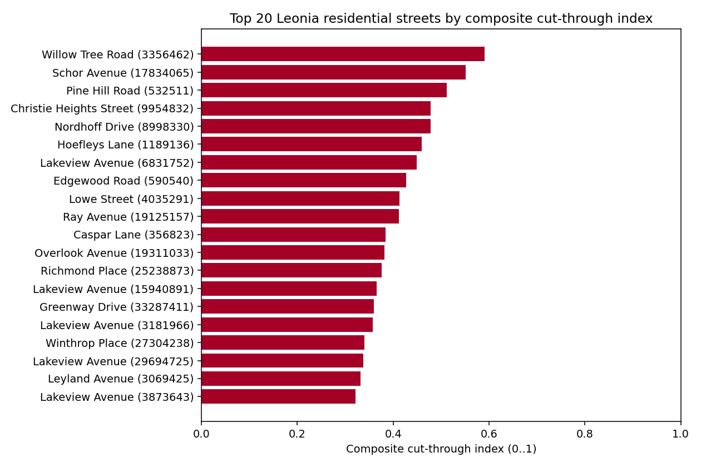
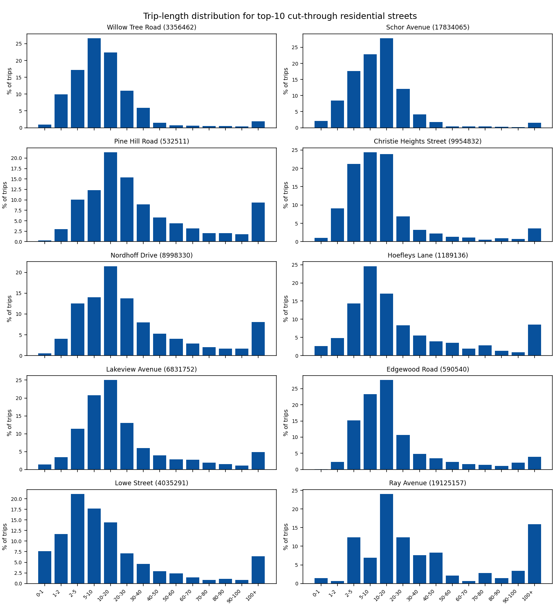
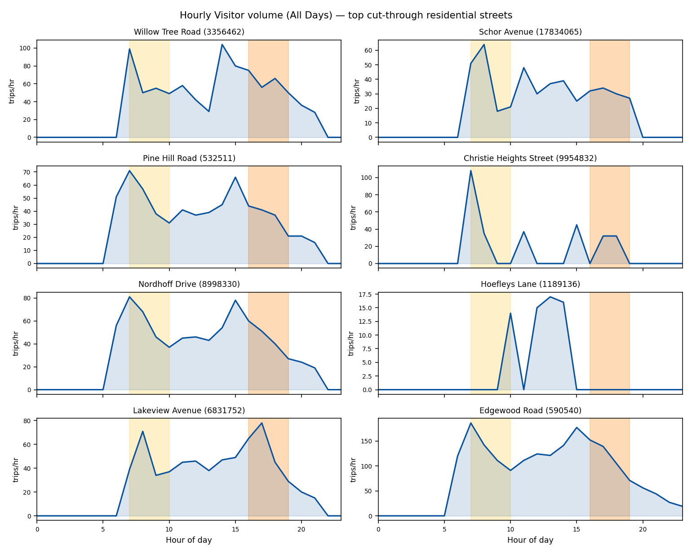
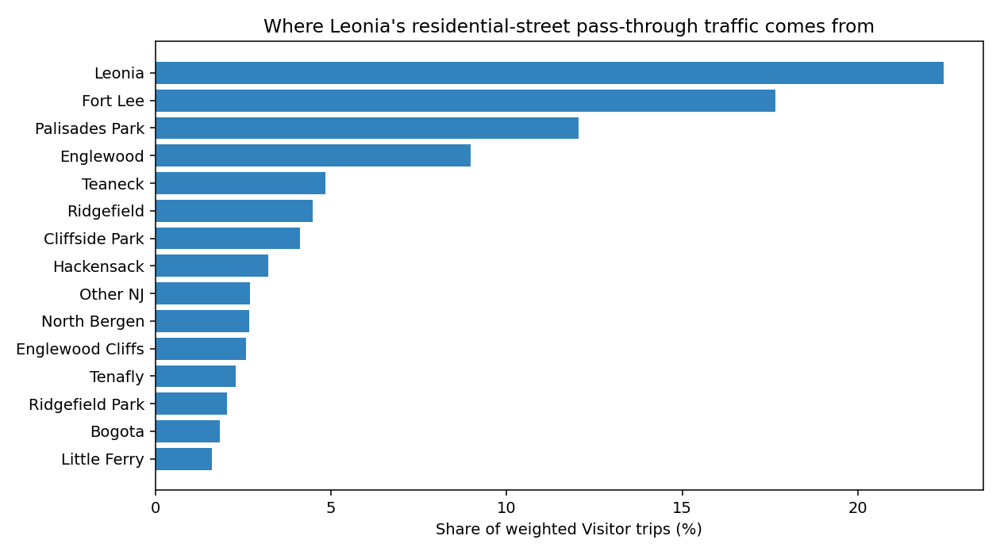
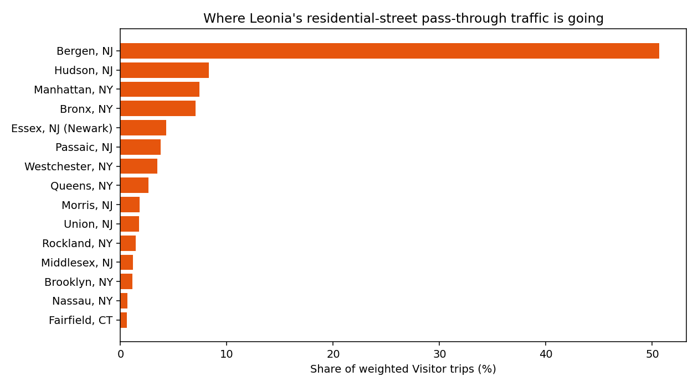

# Leonia residential streets: cut-through evidence (Pass C)

Generated by `scripts/09_leonia_streets_report.py`. Source: `streetlight/2034227_leonia_streets/` (Zone Activity on OSM Tertiary Segments, Apr 2025 – Mar 2026). Companion report: `reports/07_bridge_od.md` (Pass A perimeter OD + congestion).

> **Scope and jurisdiction.** This report covers OSM tertiary segments inside the Borough of Leonia, measured by StreetLight as *pass-through* trips by drivers whose home block-group is outside the analysis zone set (Visitors). State and federal facilities crossing the borough (NJ Turnpike, GWB approaches, US 1/9/46, NJ 4) are excluded from recommendations even when they appear in the data, because Leonia has no authority over them.

**Headline finding (Pass C.1):** Across **123 OSM tertiary segments** inside Leonia, an average of **549,796 pass-through Visitor trips/day** are made by non-resident drivers. The corridor with the highest composite cut-through index is **Willow Tree Road** (OSM way `3356462`) at **0.59** (0..1 scale, 1 = worst on every sub-metric). The next-ranked street is **Schor Avenue** (index 0.55).

## Top cut-through streets

The composite index combines weekday/weekend volume imbalance, non-local home share, the share of pass-through trips that are >5 mi (a cut-through signature, since local-only traffic is <2 mi), the share of trips in speed bins above the posted residential limit, and overall daily volume. Each sub-metric is min-max normalised before weighting.

| # | Street | OSM way | Composite index | Avg weekday vol. | Wkdy / Sat ratio | Non-local home | Trips >5mi | Speeding bins |
| --- | --- | --- | --- | --- | --- | --- | --- | --- |
| 1 | Willow Tree Road | 3,356,462 | 0.590 | 1,257 | 3.05 | 61.4% | 72.0% | 47.9% |
| 2 | Schor Avenue | 17,834,065 | 0.552 | 741 | 2.88 | 51.9% | 71.9% | 52.6% |
| 3 | Pine Hill Road | 532,511 | 0.512 | 780 | 1.41 | 63.2% | 86.6% | 67.5% |
| 4 | Christie Heights Street | 9,954,832 | 0.479 | 646 | 2.73 | 45.3% | 68.7% | 41.1% |
| 5 | Nordhoff Drive | 8,998,330 | 0.478 | 919 | 1.45 | 57.9% | 83.0% | 63.0% |
| 6 | Hoefleys Lane | 1,189,136 | 0.460 | 191 | 1.60 | 54.2% | 78.3% | 60.1% |
| 7 | Lakeview Avenue | 6,831,752 | 0.449 | 799 | 1.38 | 49.7% | 83.7% | 64.0% |
| 8 | Edgewood Road | 590,540 | 0.427 | 2,144 | 1.45 | 46.2% | 82.4% | 56.9% |
| 9 | Lowe Street | 4,035,291 | 0.413 | 210 | 1.95 | 53.8% | 59.6% | 49.9% |
| 10 | Ray Avenue | 19,125,157 | 0.412 |  |  | 53.8% | 85.5% | 72.4% |
| 11 | Caspar Lane | 356,823 | 0.385 | 317 | 1.82 | 37.9% | 70.0% | 50.8% |
| 12 | Overlook Avenue | 19,311,033 | 0.382 | 685 | 1.52 | 44.0% | 71.8% | 52.3% |
| 13 | Richmond Place | 25,238,873 | 0.376 | 186 | 1.25 | 47.2% | 75.0% | 54.1% |
| 14 | Lakeview Avenue | 15,940,891 | 0.366 | 208 | 0.89 | 52.0% | 74.6% | 60.4% |
| 15 | Greenway Drive | 33,287,411 | 0.360 |  |  | 62.8% | 76.5% | 49.1% |
| 16 | Lakeview Avenue | 3,181,966 | 0.358 |  |  | 53.3% | 76.4% | 61.9% |
| 17 | Winthrop Place | 27,304,238 | 0.340 | 432 | 1.20 | 44.8% | 73.4% | 45.8% |
| 18 | Lakeview Avenue | 29,694,725 | 0.337 |  |  | 52.7% | 73.9% | 57.2% |
| 19 | Leyland Avenue | 3,069,425 | 0.332 | 319 |  | 57.0% | 72.3% | 50.7% |
| 20 | Lakeview Avenue | 3,873,643 | 0.322 | 1,029 | 1.14 | 37.3% | 71.0% | 54.0% |

## Per-street profiles (top 10)

### Willow Tree Road (OSM way 3356462) — rank #1

- Composite cut-through index: **0.590**
- Weekday all-day Visitor volume: **1,257** trips/day
- Thursday / Saturday ratio: **3.05×**
- Non-local home share (≥3 mi): **61.4%**
- Trips with length >5 mi: **72.0%**, >10 mi: **45.4%**
- Speeding-bin share (≥25 mph): **47.9%**

  Top 5 home municipalities (Visitor share):

  - Leonia: 22.5%
  - Jersey City: 6.5%
  - Garfield (Passaic): 5.6%
  - Union City: 4.8%
  - Lodi: 4.5%

  Top 5 work destinations (Visitor share, by county):

  - Bergen, NJ: 58.5%
  - Hudson, NJ: 3.7%
  - Bronx, NY: 1.1%
  - Rockland, NY: 1.0%
  - Essex, NJ (Newark): 1.0%

### Schor Avenue (OSM way 17834065) — rank #2

- Composite cut-through index: **0.552**
- Weekday all-day Visitor volume: **741** trips/day
- Thursday / Saturday ratio: **2.88×**
- Non-local home share (≥3 mi): **51.9%**
- Trips with length >5 mi: **71.9%**, >10 mi: **49.1%**
- Speeding-bin share (≥25 mph): **52.6%**

  Top 5 home municipalities (Visitor share):

  - Leonia: 30.4%
  - Englewood: 8.9%
  - Bergenfield: 3.9%
  - Garfield (Passaic): 3.8%
  - Other NJ: 3.8%

  Top 5 work destinations (Visitor share, by county):

  - Bergen, NJ: 42.1%
  - Orange, NY: 1.2%
  - Morris, NJ: 1.2%
  - Rockland, NY: 1.0%
  - Hudson, NJ: 1.0%

### Pine Hill Road (OSM way 532511) — rank #3

- Composite cut-through index: **0.512**
- Weekday all-day Visitor volume: **780** trips/day
- Thursday / Saturday ratio: **1.41×**
- Non-local home share (≥3 mi): **63.2%**
- Trips with length >5 mi: **86.6%**, >10 mi: **74.3%**
- Speeding-bin share (≥25 mph): **67.5%**

  Top 5 home municipalities (Visitor share):

  - Leonia: 20.5%
  - Englewood: 6.1%
  - Fort Lee: 5.7%
  - Other NJ: 5.0%
  - Lodi: 4.1%

  Top 5 work destinations (Visitor share, by county):

  - Bergen, NJ: 22.4%
  - Manhattan, NY: 4.0%
  - Bronx, NY: 2.5%
  - Hudson, NJ: 2.4%
  - Queens, NY: 1.0%

### Christie Heights Street (OSM way 9954832) — rank #4

- Composite cut-through index: **0.479**
- Weekday all-day Visitor volume: **646** trips/day
- Thursday / Saturday ratio: **2.73×**
- Non-local home share (≥3 mi): **45.3%**
- Trips with length >5 mi: **68.7%**, >10 mi: **44.3%**
- Speeding-bin share (≥25 mph): **41.1%**

  Top 5 home municipalities (Visitor share):

  - Leonia: 36.4%
  - Garfield (Passaic): 8.8%
  - Edgewater: 7.9%
  - Englewood: 3.4%
  - Cliffside Park: 3.2%

  Top 5 work destinations (Visitor share, by county):

  - Bergen, NJ: 38.5%
  - Hudson, NJ: 6.4%
  - Essex, NJ (Newark): 2.6%
  - Queens, NY: 1.3%
  - Passaic, NJ: 0.6%

### Nordhoff Drive (OSM way 8998330) — rank #5

- Composite cut-through index: **0.478**
- Weekday all-day Visitor volume: **919** trips/day
- Thursday / Saturday ratio: **1.45×**
- Non-local home share (≥3 mi): **57.9%**
- Trips with length >5 mi: **83.0%**, >10 mi: **69.0%**
- Speeding-bin share (≥25 mph): **63.0%**

  Top 5 home municipalities (Visitor share):

  - Leonia: 21.7%
  - Englewood: 7.2%
  - Fort Lee: 5.8%
  - Lodi: 3.5%
  - Paramus: 2.8%

  Top 5 work destinations (Visitor share, by county):

  - Bergen, NJ: 24.3%
  - Manhattan, NY: 4.7%
  - Bronx, NY: 3.5%
  - Hudson, NJ: 1.1%
  - Queens, NY: 1.0%

### Hoefleys Lane (OSM way 1189136) — rank #6

- Composite cut-through index: **0.460**
- Weekday all-day Visitor volume: **191** trips/day
- Thursday / Saturday ratio: **1.60×**
- Non-local home share (≥3 mi): **54.2%**
- Trips with length >5 mi: **78.3%**, >10 mi: **53.7%**
- Speeding-bin share (≥25 mph): **60.1%**

  Top 5 home municipalities (Visitor share):

  - Other NJ: 18.8%
  - Fort Lee: 13.3%
  - Leonia: 3.9%
  - Palisades Park: 2.8%
  - Cliffside Park: 2.2%

  Top 5 work destinations (Visitor share, by county):

  - Bergen, NJ: 27.0%
  - Cape May, NJ: 1.7%
  - Manhattan, NY: 1.7%
  - Orange, NY: 0.5%
  - Rockland, NY: 0.5%

### Lakeview Avenue (OSM way 6831752) — rank #7

- Composite cut-through index: **0.449**
- Weekday all-day Visitor volume: **799** trips/day
- Thursday / Saturday ratio: **1.38×**
- Non-local home share (≥3 mi): **49.7%**
- Trips with length >5 mi: **83.7%**, >10 mi: **62.9%**
- Speeding-bin share (≥25 mph): **64.0%**

  Top 5 home municipalities (Visitor share):

  - Leonia: 30.7%
  - Englewood: 10.9%
  - Cliffside Park: 3.6%
  - Fort Lee: 2.9%
  - Palisades Park: 2.2%

  Top 5 work destinations (Visitor share, by county):

  - Bergen, NJ: 30.6%
  - Hudson, NJ: 14.3%
  - Passaic, NJ: 1.7%
  - Essex, NJ (Newark): 1.0%
  - Westchester, NY: 1.0%

### Edgewood Road (OSM way 590540) — rank #8

- Composite cut-through index: **0.427**
- Weekday all-day Visitor volume: **2,144** trips/day
- Thursday / Saturday ratio: **1.45×**
- Non-local home share (≥3 mi): **46.2%**
- Trips with length >5 mi: **82.4%**, >10 mi: **59.1%**
- Speeding-bin share (≥25 mph): **56.9%**

  Top 5 home municipalities (Visitor share):

  - Leonia: 17.0%
  - Fort Lee: 16.0%
  - Englewood: 8.6%
  - Englewood Cliffs: 3.7%
  - Ridgefield: 2.7%

  Top 5 work destinations (Visitor share, by county):

  - Bergen, NJ: 30.4%
  - Bronx, NY: 4.6%
  - Essex, NJ (Newark): 2.3%
  - Manhattan, NY: 1.8%
  - Hudson, NJ: 1.6%

### Lowe Street (OSM way 4035291) — rank #9

- Composite cut-through index: **0.413**
- Weekday all-day Visitor volume: **210** trips/day
- Thursday / Saturday ratio: **1.95×**
- Non-local home share (≥3 mi): **53.8%**
- Trips with length >5 mi: **59.6%**, >10 mi: **41.9%**
- Speeding-bin share (≥25 mph): **49.9%**

  Top 5 home municipalities (Visitor share):

  - Leonia: 25.3%
  - Tenafly: 16.8%
  - Palisades Park: 7.9%
  - Englewood: 5.8%
  - Teaneck: 2.6%

  Top 5 work destinations (Visitor share, by county):

  - Bergen, NJ: 42.7%
  - Bronx, NY: 2.1%
  - Rockland, NY: 1.6%
  - Union, NJ: 0.0%
  - Sussex, NJ: 0.0%

### Ray Avenue (OSM way 19125157) — rank #10

- Composite cut-through index: **0.412**
- Weekday all-day Visitor volume: **** trips/day
- Thursday / Saturday ratio: **×**
- Non-local home share (≥3 mi): **53.8%**
- Trips with length >5 mi: **85.5%**, >10 mi: **78.6%**
- Speeding-bin share (≥25 mph): **72.4%**

  Top 5 home municipalities (Visitor share):

  - Leonia: 21.2%
  - Englewood: 7.7%
  - Other NY: 5.7%
  - Bergenfield: 3.8%
  - Hackensack: 3.8%

  Top 5 work destinations (Visitor share, by county):

  - Bergen, NJ: 21.1%
  - Queens, NY: 7.7%
  - Passaic, NJ: 3.8%
  - Essex, NJ (Newark): 1.9%
  - Hudson, NJ: 1.9%

## Peak-hour deep dive

StreetLight reports volume in 1-hour day-parts, but only for zones with enough sample to support hourly disaggregation. The tables below use the **All-Days** day-type aggregate for the widest possible coverage, then restrict to the **top 15** Leonia residential segments by composite cut-through index that have hourly data available.

- **Peak AM** = 7:00–10:00 AM (StreetLight day-parts 8-10)
- **Peak PM** = 4:00–7:00 PM (day-parts 17-19)
- **Midday baseline** = 11:00 AM – 2:00 PM (day-parts 12-14), used as the off-peak comparison
- **Peak intensity** = mean peak-hour rate ÷ mean midday-hour rate. A ratio of 1.0 means the street has flat traffic (local-errand pattern); 3× or higher is a strong commuter-cut-through signature.

### Peak AM (7–10 AM) — top 15 by peak-AM volume

| Cut-through # | Street | OSM way | AM 3-hr vol. | AM trips/hr | Midday trips/hr | Peak ÷ midday |
| --- | --- | --- | --- | --- | --- | --- |
| 31 | Station Parkway | 9,551,859 | 3,176 | 222.67 | 219.33 | 1.02 |
| 25 | Bergen Boulevard | 13,166,372 | 2,912 | 220.00 | 289.67 | 0.76 |
| 35 | Station Parkway | 1,240,116 | 2,843 | 200.67 | 203.67 | 0.99 |
| 61 | Glenwood Avenue | 429,389 | 2,700 | 189.33 | 122.33 | 1.55 |
| 8 | Edgewood Road | 590,540 | 2,209 | 146.33 | 118.67 | 1.23 |
| 24 | Station Parkway | 27,007,625 | 2,003 | 138.33 | 144.67 | 0.96 |
| 62 | Hillside Avenue | 17,215,228 | 1,468 | 117.33 | 102.00 | 1.15 |
| 93 | Glenwood Avenue | 419,452 | 1,098 | 119.67 | 99.67 | 1.20 |
| 29 | Grandview Terrace | 19,093,095 | 671 | 87.33 | 53.33 | 1.64 |
| 5 | Nordhoff Drive | 8,998,330 | 361 | 65.00 | 44.67 | 1.46 |
| 54 | Station Parkway | 32,782,622 | 148 | 115.67 | 95.00 | 1.22 |

_Read this as: which Leonia residential blocks carry the most pass-through traffic during the morning commute, and how much sharper that signal is than midday._

### Peak PM (4–7 PM) — top 15 by peak-PM volume

| Cut-through # | Street | OSM way | PM 3-hr vol. | PM trips/hr | Midday trips/hr | Peak ÷ midday |
| --- | --- | --- | --- | --- | --- | --- |
| 25 | Bergen Boulevard | 13,166,372 | 3,593 | 280.67 | 289.67 | 0.97 |
| 31 | Station Parkway | 9,551,859 | 3,081 | 237.33 | 219.33 | 1.08 |
| 35 | Station Parkway | 1,240,116 | 2,836 | 219.67 | 203.67 | 1.08 |
| 24 | Station Parkway | 27,007,625 | 2,362 | 185.67 | 144.67 | 1.28 |
| 42 | Challenger Road | 590,580 | 1,881 | 152.00 | 115.67 | 1.31 |
| 8 | Edgewood Road | 590,540 | 1,488 | 132.00 | 118.67 | 1.11 |
| 61 | Glenwood Avenue | 429,389 | 1,362 | 143.00 | 122.33 | 1.17 |
| 62 | Hillside Avenue | 17,215,228 | 976 | 127.67 | 102.00 | 1.25 |
| 93 | Glenwood Avenue | 419,452 | 699 | 103.00 | 99.67 | 1.03 |
| 36 | Challenger Road | 1,766,464 | 468 | 104.67 | 70.00 | 1.50 |
| 58 | Hillside Avenue | 17,215,229 | 343 | 96.67 | 86.33 | 1.12 |
| 20 | Lakeview Avenue | 3,873,643 | 277 | 85.00 | 54.67 | 1.55 |

_PM-peak volumes are systematically higher than AM-peak on Leonia residential streets (longer evening rush window plus school pick-up). A street that's high on both lists is carrying bidirectional commuter traffic._

### Streets with the sharpest peak-vs-midday spike

| Cut-through # | Street | OSM way | AM peak trips/hr | AM ÷ midday | PM peak trips/hr | PM ÷ midday |
| --- | --- | --- | --- | --- | --- | --- |
| 40 | Birch Lane | 8,776,800 | 39.33 | 7.87 | 18.33 | 3.67 |
| 83 | Howard Terrace | 12,631,493 | 8.00 | 1.41 | 23.00 | 4.06 |
| 4 | Christie Heights Street | 9,954,832 | 47.67 | 3.86 | 21.33 | 1.73 |
| 89 | Moore Avenue | 14,413,684 | 0.00 |  | 24.67 | 3.70 |
| 51 | Highwood Avenue | 14,309,553 | 0.00 |  | 13.67 | 2.73 |
| 77 | Longview Avenue | 22,343,549 | 0.00 |  | 11.33 | 2.13 |
| 63 | Leonia Avenue | 17,509,127 | 6.67 | 1.11 | 12.00 | 2.00 |
| 12 | Overlook Avenue | 19,311,033 | 65.33 | 1.92 | 40.00 | 1.18 |
| 22 | Vreeland Avenue | 18,848,062 | 42.33 | 1.84 | 29.67 | 1.29 |
| 29 | Grandview Terrace | 19,093,095 | 87.33 | 1.64 | 57.67 | 1.08 |
| 1 | Willow Tree Road | 3,356,462 | 68.00 | 1.58 | 65.67 | 1.53 |
| 45 | Van Orden Avenue | 19,616,618 | 36.33 | 1.56 | 27.00 | 1.16 |
| 20 | Lakeview Avenue | 3,873,643 | 56.67 | 1.04 | 85.00 | 1.55 |
| 61 | Glenwood Avenue | 429,389 | 189.33 | 1.55 | 143.00 | 1.17 |
| 28 | Linden Terrace | 4,363,348 | 33.67 | 1.33 | 39.00 | 1.54 |

Streets near the top of this table behave like commuter shortcuts: very quiet at midday, but bursting in the AM or PM peak. Speed humps, traffic calming, or peak-period turn restrictions on these blocks would have the largest relative effect on residents' lived experience.

**Coverage caveat.** Only 76 of the residential segments in the Pass-C export have an hourly breakdown (the rest only have All-Day totals). Segments missing from the tables above are not zero — they simply do not have enough sampled trips in any one hour for StreetLight to publish an hourly figure.

## Where the cut-through is coming from

Volume-weighted share of pass-through Visitor trips across all Leonia residential streets, grouped by the driver's home municipality (ZIP-derived):

| Home municipality | Share of weighted Visitor trips |
| --- | --- |
| Leonia | 22.4% |
| Fort Lee | 17.6% |
| Palisades Park | 12.1% |
| Englewood | 9.0% |
| Teaneck | 4.9% |
| Ridgefield | 4.5% |
| Cliffside Park | 4.1% |
| Hackensack | 3.2% |
| Other NJ | 2.7% |
| North Bergen | 2.7% |
| Englewood Cliffs | 2.6% |
| Tenafly | 2.3% |
| Ridgefield Park | 2.0% |
| Bogota | 1.8% |
| Little Ferry | 1.6% |

## Where the cut-through is going

Volume-weighted share of pass-through Visitor trips across all Leonia residential streets, grouped by the driver's *workplace* county (derived from the StreetLight work-block-group cross-tab). StreetLight does not expose an explicit trip destination, but for the AM-peak cut-through pattern the workplace location is a strong proxy for where the trip is headed.

| Work destination county | Share of weighted Visitor trips |
| --- | --- |
| Bergen, NJ | 50.7% |
| Hudson, NJ | 8.3% |
| Manhattan, NY | 7.4% |
| Bronx, NY | 7.0% |
| Essex, NJ (Newark) | 4.3% |
| Passaic, NJ | 3.8% |
| Westchester, NY | 3.4% |
| Queens, NY | 2.6% |
| Morris, NJ | 1.8% |
| Union, NJ | 1.8% |
| Rockland, NY | 1.4% |
| Middlesex, NJ | 1.2% |
| Brooklyn, NY | 1.1% |
| Nassau, NY | 0.7% |
| Fairfield, CT | 0.6% |

## Coverage update

This export covers **375 OSM tertiary segments** across **106 unique street names** inside (or immediately touching) Leonia. The previous Congestion Trends export covered 7 named in-borough streets only — Pass C closes that gap. Residential blocks (Christie Heights, Hillside, Glenwood, Park, Highwood, Schor, Willow Tree, Crescent, Walnut, Birch, etc.) now have direct pass-through measurements.

The residential-coverage caveat at the bottom of `reports/07_bridge_od.md` should be read alongside this report.

## Interactive maps

- [Composite cut-through index](maps/street_cutthrough_index.html)
- [Visitor weekday volume](maps/street_visitor_volume.html)
- [Speeding-bin share](maps/street_speeding.html)

## Notes on data limitations

* **Visitor definition** — StreetLight tags a trip as Visitor when the driver's home block-group is outside the analysis zone set. A non-resident commuting *to* a Leonia destination is therefore still a Visitor, even if the trip doesn't continue through. The composite index weights `long_trip_share_5mi` precisely to distinguish through-trips from short destination trips.
* **Speed bins are coarse** (10-mph wide). The `speeding_share` for posted ≤25 mph uses the 20-30 mph bin as the lower bound, which slightly over-states speeding; the report exposes the raw trip-speed distribution per street so readers can inspect individual streets.
* **Day-type "weekday" excludes Friday** — the export's day types are All / Mon / Tue / Wed / Thu / Sat / Sun. We use Thu as the canonical weekday day and Mon-Thu for Peak-AM aggregations to stay consistent with Pass A.
* **ZIP-only home location** — Pass C uses StreetLight's pre-ranked top home ZIPs (no ACS join). The static ZIP→municipality lookup in `analysis/visitor_demographics.py` covers the top ~40 ZIPs; unmatched ZIPs fall into `Other NJ`, `Other NY`, or `Other`.
* **Destination = workplace, not trip-end** — the Zone Activity product does not expose trip destination directly. The destination columns in this report come from StreetLight's work-block-group cross-tab, which characterises the driver's workplace location. For AM-peak commuter cut-through that is the right answer; for non-work pass-through (errands, evening trips) the workplace is a less reliable proxy and the destination story should be read with that caveat.
